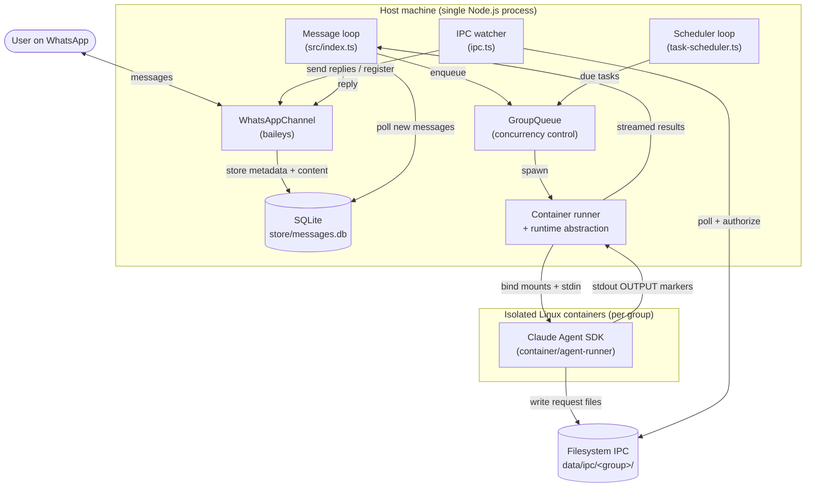
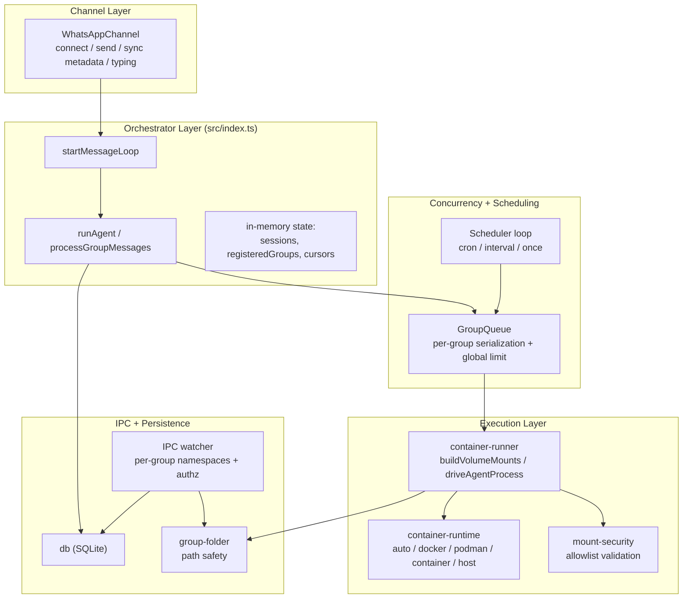

# NanoClaw - System Architecture

**Version**: 1.1.0
**Last Updated**: 2026-05-31

---

## Table of Contents

1. [System Overview](#system-overview)
2. [Architecture Principles](#architecture-principles)
3. [System Context](#system-context)
4. [Component Architecture](#component-architecture)
5. [Data Model](#data-model)
6. [Key Design Decisions](#key-design-decisions)
7. [Security Architecture](#security-architecture)
8. [Cross-Platform Support](#cross-platform-support)
9. [Beyond `src/`](#beyond-src)

---

## System Overview

NanoClaw is a personal Claude assistant: a single Node.js orchestrator process
that connects to WhatsApp, routes triggered messages to the Claude Agent SDK,
and runs each agent invocation inside an isolated Linux container. Every chat
("group") gets its own filesystem, memory (`CLAUDE.md`), Claude session, and IPC
namespace, so groups cannot see or influence one another.

The core loop is deliberately small:

```
WhatsApp (baileys) → SQLite → polling loop → per-group queue → container (Claude Agent SDK) → response
```

### Key Statistics

Numbers below come from the autogenerated
`dependency-summary.compact.json` produced by `tools/create-dependency-graph`
on 2026-05-31. The dependency tool scans `src/` only — the `setup/`,
`skills-engine/`, and `container/agent-runner/` subsystems are described in
[Beyond `src/`](#beyond-src) but are *not* part of these counts.

| Metric | Value |
|--------|-------|
| Source files (`src/`) | 17 TypeScript files |
| Lines of code | 4,614 |
| Total exports | 85 |
| Re-exports (barrel) | 0 |
| Classes | 2 (`WhatsAppChannel`, `GroupQueue`) |
| Interfaces | 18 |
| Functions | 63 |
| Type guards | 2 |
| Enums | 0 |
| Type-only imports | 0 |
| Runtime circular dependencies | 0 |
| Type-only circular dependencies | 0 |
| Modules | 3 (`channels`, `root`, `entry`) |

### Module Distribution

| Module | Files | Contents |
|--------|-------|----------|
| `entry` | 1 | `src/index.ts` — orchestrator, message loop, agent invocation |
| `channels` | 1 | `src/channels/whatsapp.ts` — `WhatsAppChannel` (baileys) |
| `root` | 15 | `config`, `env`, `logger`, `db`, `router`, `group-folder`, `group-queue`, `container-runner`, `container-runtime`, `mount-security`, `ipc`, `task-scheduler`, `fs-sync`, `types`, `whatsapp-auth` |

The dependency graph is acyclic. `src/index.ts` is the only entry point
(imports from 12 files, exports to none); `src/logger.ts` and `src/types.ts`
are leaf dependencies imported almost everywhere. See
[DEPENDENCY_GRAPH.md](./DEPENDENCY_GRAPH.md) for the full matrix.

---

## Architecture Principles

These are NanoClaw's actual principles, drawn from
[README.md](../../README.md) and [docs/REQUIREMENTS.md](../REQUIREMENTS.md).

### 1. Small Enough to Understand

One Node.js process, 17 source files, no microservices, no message queues, no
abstraction layers. The whole system is meant to be read and understood in a
sitting. Customization is expected to happen *in* this codebase, so it stays
small on purpose.

### 2. Secure by Container Isolation

Security is enforced at the OS level, not by application-level permission
checks. Agents run in actual Linux containers (Docker / Podman / Apple
Container) and can only see what is explicitly bind-mounted. Bash and tool use
are safe because commands execute inside the container, never on the host.

### 3. Per-Group Isolation

Each registered group is fully isolated: its own group folder under `groups/`,
its own `.claude/` session directory, its own IPC namespace under
`data/ipc/<folder>/`, and its own Claude session ID. The orchestrator validates
every group folder name (`src/group-folder.ts`) so a folder can never escape its
base directory. The only shared, cross-group surface is global memory
(`groups/global/`), which is read-only for non-main groups.

### 4. Customization = Code Changes

There is almost no configuration surface. Only minimal values (trigger word,
timeouts, concurrency) live in env-backed `src/config.ts`; everything else is
changed by editing code. Capabilities are added through Claude Code *skills*
(`/add-telegram`, `/add-gmail`, etc.) that transform a fork rather than through
config flags or feature toggles baked into the base system.

---

## System Context



### External Actors

1. **User on WhatsApp** — the human messaging the assistant via a trigger word
   (`@Andy` by default).
2. **Container runtime** — Docker, Podman, or Apple Container, supplying the
   sandbox; or `host` mode for no sandbox at all.
3. **Claude Agent SDK** — runs *inside* the container as the actual agent
   (`container/agent-runner`).
4. **Filesystem** — SQLite database, per-group folders, and the IPC tree are
   all on the host filesystem.

---

## Component Architecture



### Channel Layer — `src/channels/whatsapp.ts`

`WhatsAppChannel` implements the small `Channel` interface from `src/types.ts`
(`connect`, `sendMessage`, `isConnected`, `ownsJid`, `disconnect`, optional
`setTyping`). It wraps the `@whiskeysockets/baileys` WhatsApp Web client,
handles QR/multi-file auth, persists chat metadata and message content into
SQLite via callbacks, and periodically syncs group metadata (every 24h).
Because routing is built around the `Channel` interface and `findChannel()` in
`src/router.ts`, adding another channel (Telegram, Discord, …) is a matter of
implementing the interface — which is exactly what the `/add-*` skills do.

### Orchestrator / Message Loop — `src/index.ts`

The orchestrator owns all in-memory state (`sessions`, `registeredGroups`,
`lastTimestamp`, per-group `lastAgentTimestamp` cursors) and the main loop:

- `startMessageLoop()` polls `getNewMessages()` every `POLL_INTERVAL` (2s) for
  registered JIDs, advances the "seen" cursor immediately, groups messages by
  chat, and applies the trigger rule (`TRIGGER_PATTERN`).
- For non-main groups, only a message matching the trigger activates the agent;
  untriggered messages accumulate in SQLite and are pulled as context the next
  time a trigger arrives. The **main** group (self-chat) never requires a
  trigger.
- If a container is already live for a group, new input is *piped* to it via the
  IPC `input/` directory (`queue.sendMessage`); otherwise a fresh run is
  enqueued.
- `runAgent()` writes the tasks/groups snapshots, invokes `runContainerAgent`,
  streams results back through `onOutput`, strips `<internal>…</internal>`
  reasoning blocks, sends user-visible text, and tracks the returned
  `newSessionId` to persist the session.
- Cursor handling is crash-safe: cursors advance before processing and roll back
  on error (unless output was already sent, to avoid duplicate replies).
  `recoverPendingMessages()` re-enqueues unprocessed messages on startup.

### Group Queue — `src/group-queue.ts`

`GroupQueue` is the concurrency controller. It guarantees **at most one active
container per group** and a **global cap** of `MAX_CONCURRENT_CONTAINERS`
(default 5). It distinguishes message runs from task runs, prioritizes tasks
over messages when draining, preempts an idle-waiting container when a task
arrives, and implements exponential-backoff retries (max 5,
`5s * 2^(n-1)`). On shutdown it *detaches* rather than kills active containers
(the `--rm` flag cleans them up on exit), so a WhatsApp reconnect-driven restart
does not abort in-flight agents.

### Container Runner + Runtime Abstraction — `src/container-runner.ts`, `src/container-runtime.ts`

`container-runner.ts` builds the mount set and drives the agent process:

- **`buildVolumeMounts()`** decides what each group can see. Main gets the
  project root **read-only** at `/workspace/project` plus its writable group
  folder; non-main groups get only their own folder plus read-only
  `groups/global/`. Every group additionally gets an isolated
  `~/.claude` (per-group `data/sessions/<folder>/.claude`, with a generated
  `settings.json` enabling agent teams and Claude memory), its own
  `/workspace/ipc`, and a per-group writable copy of the agent-runner source
  (synced via `fs-sync.ts`).
- **`driveAgentProcess()`** is shared by container and host modes. It writes the
  `ContainerInput` (with secrets) to stdin, stream-parses
  `---NANOCLAW_OUTPUT_START/END---` marker pairs from stdout into
  `ContainerOutput` objects, enforces an activity-resetting hard timeout (with a
  24h clamp on the per-group configurable timeout), bounds captured output to
  `CONTAINER_MAX_OUTPUT_SIZE`, and writes a run log per invocation.

`container-runtime.ts` is the single place runtime selection lives, chosen via
`CONTAINER_RUNTIME`:

| `CONTAINER_RUNTIME` | Behavior |
|---------------------|----------|
| `auto` (default) | First available of `docker`, `podman`, `container`; never silently falls back to host |
| `docker` / `podman` / `container` | Use that runtime explicitly |
| `host` | Run the agent-runner directly on the host with **no container, no filesystem isolation** |

It exposes `resolveRuntime` (pure resolver), `isHostMode`, `bindMountArgs`
(handles Windows path normalization and the `:ro` flag), `stopContainer`,
`ensureContainerRuntimeRunning`, and `cleanupOrphans` (kills leftover
`nanoclaw-*` containers on startup). In **host mode**, `runHostAgent()` spawns
the prebuilt `container/agent-runner/dist/index.js` with `node`, passing the
workspace directories as `NANOCLAW_*` env vars and isolating per-group Claude
config via `HOME`/`USERPROFILE`/`CLAUDE_CONFIG_DIR`. Host mode trades the
sandbox away: the additional-mount allowlist no longer applies and the agent
inherits the orchestrator's environment.

### IPC Watcher — `src/ipc.ts`

The agent, running inside the container, cannot call back into the orchestrator
directly. Instead the in-container MCP server
(`container/agent-runner/src/ipc-mcp-stdio.ts`) writes request files into
`/workspace/ipc/{messages,tasks}/`, which maps to the host at
`data/ipc/<group>/…`. The IPC watcher polls every `IPC_POLL_INTERVAL` (1s):

- **Identity is the directory.** The source group's identity (`sourceGroup`,
  `isMain`) is derived from which IPC directory the file appears in — it is not
  taken from the file contents — so an agent cannot forge its identity.
- **Authorization is per-operation.** A non-main group may only send messages to
  its own chat and may only schedule/pause/resume/cancel tasks it owns. Only the
  **main** group may `register_group`, `refresh_groups`, or address other
  groups.
- **`register_group` folder-hijack guard.** Because `registered_groups.folder`
  is UNIQUE and persisted via INSERT-OR-REPLACE, re-registering an existing
  folder under a new JID would silently steal that group's folder, sessions,
  memory, and IPC namespace. The watcher rejects any registration where the
  folder is already owned by a different JID (or the JID already maps to a
  different folder), and validates the folder name first.
- Malformed files are moved to `data/ipc/errors/` rather than reprocessed.

The supported IPC operations correspond to the agent's MCP tools:
`send_message`, `schedule_task`, `list_tasks`, `pause_task`, `resume_task`,
`cancel_task`, `register_group`.

### Scheduler — `src/task-scheduler.ts`

`startSchedulerLoop()` polls `getDueTasks()` every `SCHEDULER_POLL_INTERVAL`
(60s), re-checks each task is still active, and hands it to the `GroupQueue` as a
task run. Each task executes a full agent in its group's context. Tasks support
three schedule types — `cron` (parsed with `cron-parser` in `TIMEZONE`),
`interval` (ms), and `once` (ISO timestamp) — and two context modes: `group`
(reuses the group's live session) and `isolated`. Results are forwarded to the
chat and every run is recorded in `task_run_logs` with duration and status.
Task containers are closed promptly (`TASK_CLOSE_DELAY_MS`) rather than waiting
out the full idle timeout, since tasks are single-turn.

### Persistence — `src/db.ts`

A single `better-sqlite3` database at `store/messages.db` holds all durable
state. `db.ts` owns the schema, idempotent column migrations (e.g.
`context_mode`, `is_bot_message`, `channel`/`is_group`), and a one-time
migration that imports legacy `data/*.json` state files. Group folder names read
back from `registered_groups` are re-validated through `isValidGroupFolder`, so
a tampered row can never produce an unsafe path.

---

## Data Model

All durable state lives in SQLite (`store/messages.db`). The schema is created
in `src/db.ts`.

### `chats` — chat metadata (no message content for unregistered chats)

```sql
CREATE TABLE chats (
  jid TEXT PRIMARY KEY,
  name TEXT,
  last_message_time TEXT,
  channel TEXT,
  is_group INTEGER DEFAULT 0
);
```

### `messages` — message history for registered groups

```sql
CREATE TABLE messages (
  id TEXT,
  chat_jid TEXT,
  sender TEXT,
  sender_name TEXT,
  content TEXT,
  timestamp TEXT,
  is_from_me INTEGER,           -- retained for audit; not read back
  is_bot_message INTEGER DEFAULT 0,
  PRIMARY KEY (id, chat_jid),
  FOREIGN KEY (chat_jid) REFERENCES chats(jid)
);
CREATE INDEX idx_timestamp ON messages(timestamp);
```

### `scheduled_tasks` — recurring / one-time jobs

```sql
CREATE TABLE scheduled_tasks (
  id TEXT PRIMARY KEY,
  group_folder TEXT NOT NULL,
  chat_jid TEXT NOT NULL,
  prompt TEXT NOT NULL,
  schedule_type TEXT NOT NULL,        -- 'cron' | 'interval' | 'once'
  schedule_value TEXT NOT NULL,
  next_run TEXT,
  last_run TEXT,
  last_result TEXT,
  status TEXT DEFAULT 'active',       -- 'active' | 'paused' | 'completed'
  context_mode TEXT DEFAULT 'isolated', -- 'group' | 'isolated'
  created_at TEXT NOT NULL
);
CREATE INDEX idx_next_run ON scheduled_tasks(next_run);
CREATE INDEX idx_status ON scheduled_tasks(status);
```

### `task_run_logs` — per-run history

```sql
CREATE TABLE task_run_logs (
  id INTEGER PRIMARY KEY AUTOINCREMENT,
  task_id TEXT NOT NULL,
  run_at TEXT NOT NULL,
  duration_ms INTEGER NOT NULL,
  status TEXT NOT NULL,               -- 'success' | 'error'
  result TEXT,
  error TEXT,
  FOREIGN KEY (task_id) REFERENCES scheduled_tasks(id)
);
CREATE INDEX idx_task_run_logs ON task_run_logs(task_id, run_at);
```

### `router_state` — message-loop cursors

```sql
CREATE TABLE router_state (key TEXT PRIMARY KEY, value TEXT NOT NULL);
-- keys: 'last_timestamp', 'last_agent_timestamp' (JSON per-group map)
```

### `sessions` — per-group Claude session IDs

```sql
CREATE TABLE sessions (group_folder TEXT PRIMARY KEY, session_id TEXT NOT NULL);
```

### `registered_groups` — the groups the orchestrator acts on

```sql
CREATE TABLE registered_groups (
  jid TEXT PRIMARY KEY,
  name TEXT NOT NULL,
  folder TEXT NOT NULL UNIQUE,        -- UNIQUE: anchors the folder-hijack guard
  trigger_pattern TEXT NOT NULL,
  added_at TEXT NOT NULL,
  container_config TEXT,              -- JSON: additionalMounts, timeout
  requires_trigger INTEGER DEFAULT 1
);
```

---

## Key Design Decisions

### 1. Containers, Not Permission Checks

**Decision**: Isolate agents with OS-level containers instead of
application-level allowlists/permission systems.

**Rationale**: Permission systems are leaky and hard to audit; the predecessor
project tried this and became a security maze. A container can only touch what
is bind-mounted, so Bash and arbitrary tool use are safe by construction. The
trade-off is a hard dependency on a container runtime — addressed by the
pluggable runtime and the explicit, opt-in `host` escape hatch.

### 2. Filesystem IPC

**Decision**: The in-container agent communicates with the orchestrator by
writing JSON files into a bind-mounted IPC directory, polled by the host.

**Rationale**: No network surface between agent and host, no sockets to secure,
and the directory the file lands in *is* the agent's identity — making
authorization trivial and unforgeable. Writes use temp-file-then-rename for
atomicity; the host consumes and deletes them.

### 3. Pluggable Runtime + Host Mode

**Decision**: All runtime-specific logic lives in `container-runtime.ts`,
selected by `CONTAINER_RUNTIME`. `auto` probes docker/podman/container; `host`
opts out of containers entirely.

**Rationale**: Docker is the default but optional; users can pick Podman or
Apple Container, or run sandbox-free on machines without a runtime. Keeping it in
one file means swapping runtimes touches exactly one module. `auto` deliberately
*never* falls back to `host` — losing the sandbox must be an explicit choice.

### 4. The `register_group` Folder-Hijack Guard

**Decision**: Reject any `register_group` IPC request that would bind an
already-owned folder to a new JID (or remap a JID to a new folder).

**Rationale**: `registered_groups.folder` is UNIQUE and written with INSERT OR
REPLACE. Without the guard, a malicious or buggy registration could silently
take over another group's folder, sessions, memory, and IPC namespace —
defeating per-group isolation. The guard, plus the main-only restriction on
`register_group`, closes that path.

### 5. Mount Allowlist Stored Outside the Project

**Decision**: Additional bind mounts are validated against an allowlist at
`~/.config/nanoclaw/mount-allowlist.json`, which is never mounted into any
container.

**Rationale**: If the allowlist lived in the repo it could be edited by an agent
with write access to the project and then bypassed on the next run. Storing it
outside every mount makes it tamper-proof from containers. With no allowlist
present, **all** additional mounts are blocked (fail-closed).

### 6. Read-Only Project Mount for Main

**Decision**: The main group sees the project root read-only; its writable
working area is its group folder.

**Rationale**: The main (admin) group is powerful, but it must not be able to
modify host application code (`src/`, `dist/`, `package.json`), which would
bypass the sandbox entirely on the next restart.

---

## Security Architecture

NanoClaw's security model is "isolation first." The full model is in
[docs/SECURITY.md](../SECURITY.md); the architecture-relevant pieces:

### Mount Allowlist — `src/mount-security.ts`

- Allowlist at `~/.config/nanoclaw/mount-allowlist.json` (outside all mounts).
- Every requested additional mount is resolved through `realpathSync` (defeats
  symlink escapes), checked against `blockedPatterns` (defaults include `.ssh`,
  `.aws`, `.env`, `credentials`, private-key names; case-insensitive), and must
  fall under an `allowedRoot`.
- Container paths are validated to be relative, free of `..`, colons, and
  control characters; host paths are rejected for stray colons (which could
  inject a `:rw` mode and defeat a read-only mount) — only a Windows
  drive-letter colon is permitted.
- Non-main groups can be forced read-only via `nonMainReadOnly`. Mounts that
  pass land under `/workspace/extra/`.
- **Fail-closed**: a missing or invalid allowlist blocks all additional mounts.

### IPC Identity Model — `src/ipc.ts`

- A group's identity is the IPC directory its request appears in, never the file
  contents — so identity cannot be forged.
- Per-operation authorization: only main can register groups, refresh metadata,
  or act across groups; non-main groups are confined to their own chat and
  tasks. The folder-hijack guard protects `register_group`.

### Read-Only Project Mount

The main group mounts the project root read-only (`/workspace/project`) so the
agent cannot rewrite host code that runs outside the sandbox.

### Secrets via Stdin

`config.ts` deliberately does **not** read secrets, to keep them out of the
process environment (and thus out of child processes). `container-runner.ts`
reads `CLAUDE_CODE_OAUTH_TOKEN` / `ANTHROPIC_API_KEY` from `.env` only at the
moment of spawning and writes them to the container's **stdin** — never to disk
and never as a mounted file. The `.env` file itself is on the default
mount-blocklist.

### Path Safety — `src/group-folder.ts`

Group folder names must match `^[A-Za-z0-9][A-Za-z0-9_-]{0,63}$`, excluding
path separators and `..`. `resolveGroupFolderPath` / `resolveGroupIpcPath`
additionally assert the resolved path stays within its base directory, so no
group can reach another group's data.

---

## Cross-Platform Support

NanoClaw runs on macOS, Linux, and natively on Windows 10/11. The orchestrator
is always a native Node.js process; only the agent containers need a Linux
container runtime.

| Platform | Service manager | Container runtime |
|----------|-----------------|-------------------|
| macOS | launchd (`~/Library/LaunchAgents/com.nanoclaw.plist`) | Docker / Podman / Apple Container |
| Linux | systemd (`systemctl --user … nanoclaw`) | Docker / Podman |
| Windows 10/11 | logon Scheduled Task (`schtasks`) + `start-nanoclaw.cmd` | Docker Desktop (WSL2 backend) |

Cross-platform details handled in code:

- `container-runtime.ts` resolves runtime binaries with `where` on Windows vs
  `command -v` on POSIX, normalizes mount sources to forward slashes on Windows,
  and resolves the runtime to a full `.exe` path so `spawn` works without a
  shell.
- `container-runner.ts` only adds `--user uid:gid` when `getuid` is available and
  not root/node — i.e. it is skipped on native Windows.
- `mount-security.ts` permits exactly one Windows drive-letter colon and rejects
  every other colon.
- Windows 10/11 are keyed purely on the `win32` platform (so they behave
  identically); Windows 10 only needs build 19041+ for the WSL2 backend.

**`host` mode** (`CONTAINER_RUNTIME=host`) is the platform-independent escape
hatch: it runs the prebuilt agent-runner directly with no container on any OS,
at the cost of the sandbox and the mount allowlist.

---

## Beyond `src/`

The dependency graph scans `src/` only. Three sibling subsystems are part of the
running system but outside that scan:

### `setup/` — the `/setup` step runner

A `npx tsx setup/index.ts --step <name>` CLI driving first-time installation,
one step at a time: `environment`, `container`, `whatsapp-auth`, `groups`,
`register`, `mounts`, `service`, `verify`. It is what the `/setup` skill invokes
to install dependencies, authenticate WhatsApp, configure mounts, register the
main channel, and install the platform service.

### `skills-engine/`

The machinery behind the `/update` and `/customize` skills: applying,
merging, rebasing, and migrating upstream NanoClaw changes onto a user's
customized fork (`apply.ts`, `merge.ts`, `rebase.ts`, `migrate.ts`, `backup.ts`,
manifest/state tracking, file ops). It keeps a fork updatable despite local code
changes — the linchpin of the "customization = code" principle.

### `container/agent-runner/` — the in-container agent

The Claude Agent SDK runner that actually executes inside each container (or on
the host in host mode). `src/index.ts` reads the `ContainerInput` from stdin,
runs the SDK `query()` loop (with agent-teams/swarm support), emits results
between `---NANOCLAW_OUTPUT_START/END---` markers, and consumes follow-up
messages from `/workspace/ipc/input/`. `src/ipc-mcp-stdio.ts` is the in-container
MCP server exposing the agent's tools (`send_message`, `schedule_task`,
`list_tasks`, `pause_task`, `resume_task`, `cancel_task`, `register_group`),
which become the request files the host's IPC watcher consumes. The
`container/skills/` directory (e.g. `agent-browser`) is synced into each group's
`.claude/skills/`.

---

## Related Documentation

- [OVERVIEW.md](./OVERVIEW.md) — project overview and getting started
- [DEPENDENCY_GRAPH.md](./DEPENDENCY_GRAPH.md) — autogenerated dependency analysis
- [TEST_COVERAGE.md](./TEST_COVERAGE.md) — autogenerated test-coverage report
- [unused-analysis.md](./unused-analysis.md) — unused files/exports analysis
- [../REQUIREMENTS.md](../REQUIREMENTS.md) — original requirements and decisions
- [../SECURITY.md](../SECURITY.md) — full security model
