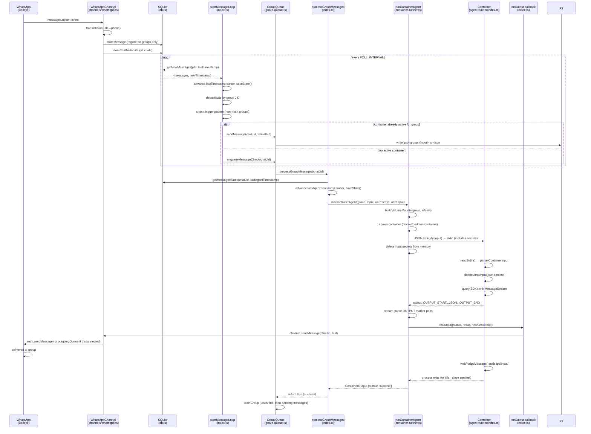
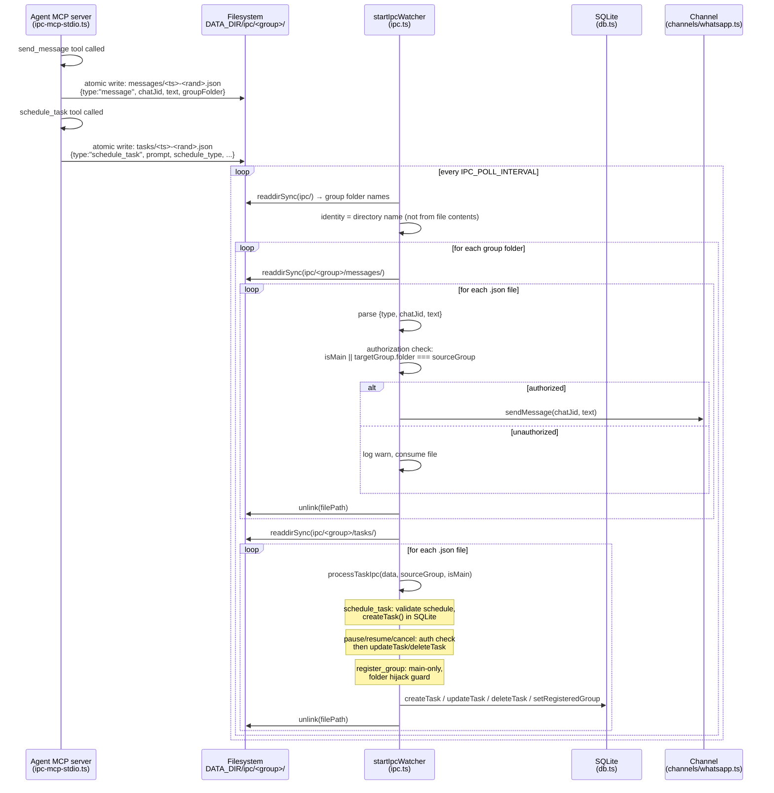
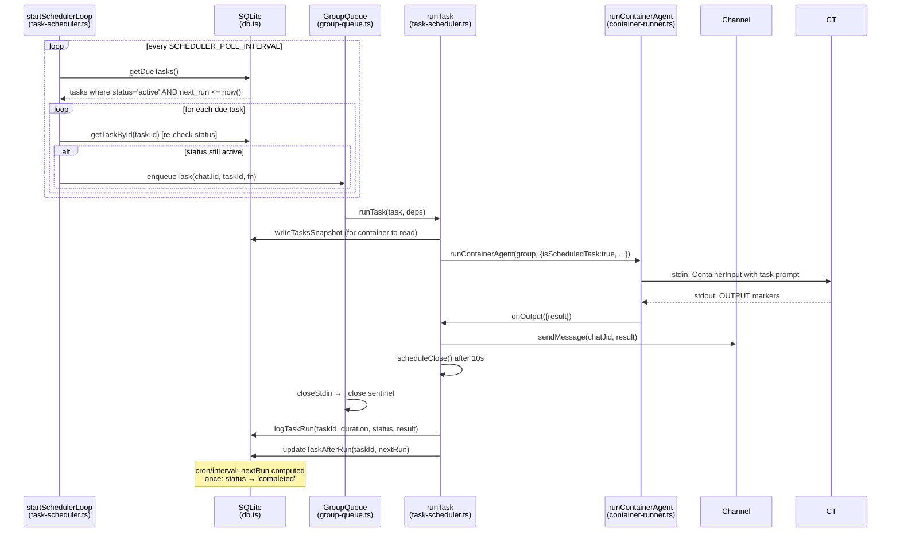
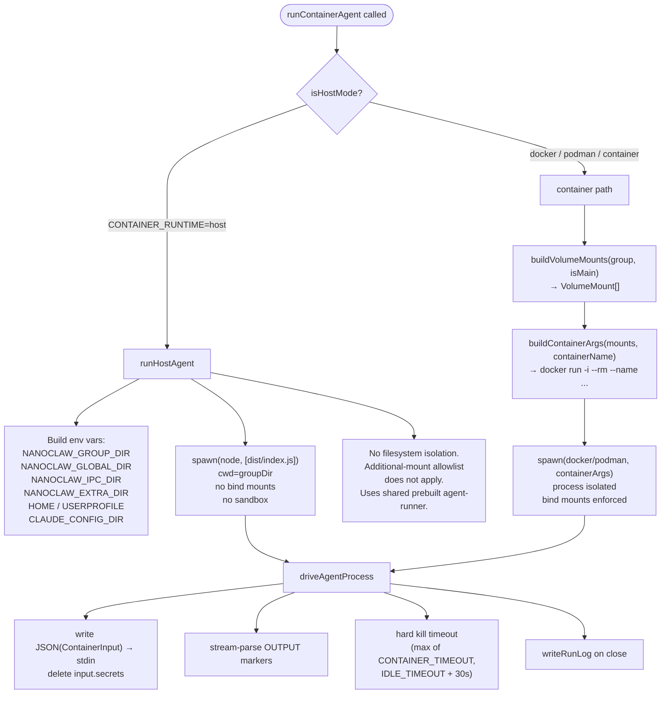

# NanoClaw — Data Flow Documentation

**Last Updated**: 2026-05-31

---

## Table of Contents

1. [Overview](#overview)
2. [Inbound WhatsApp Message → Agent → Reply](#inbound-whatsapp-message--agent--reply)
3. [Filesystem IPC Round-Trip](#filesystem-ipc-round-trip)
4. [Scheduled Task Firing](#scheduled-task-firing)
5. [Host-Mode vs Container-Mode Execution](#host-mode-vs-container-mode-execution)
6. [Secrets Flow](#secrets-flow)

---

## Overview

NanoClaw is a single Node.js process (the **orchestrator**, `src/index.ts`) that connects to WhatsApp and routes messages to Claude Agent SDK sessions running inside Linux containers (or directly on the host). Each registered group gets its own isolated filesystem, session history, and IPC namespace. The orchestrator never runs Claude itself — it manages containers and coordinates the three subsystems that run concurrently:

```
┌────────────────────────────────────────────────────────────────┐
│  Orchestrator (src/index.ts)                                   │
│                                                                │
│  ┌──────────────────┐  ┌────────────────┐  ┌──────────────┐  │
│  │  startMessage-   │  │ startScheduler │  │ startIpc-    │  │
│  │  Loop (polling)  │  │ Loop (polling) │  │ Watcher      │  │
│  └────────┬─────────┘  └───────┬────────┘  └──────┬───────┘  │
│           │                    │                   │           │
│           └────────────────────┴────────┬──────────┘           │
│                                         │                      │
│                              ┌──────────▼──────────┐           │
│                              │     GroupQueue      │           │
│                              │  (per-group serial, │           │
│                              │   global concurrency│           │
│                              │   cap)              │           │
│                              └──────────┬──────────┘           │
└─────────────────────────────────────────┼──────────────────────┘
                                          │
                              ┌───────────▼───────────┐
                              │  runContainerAgent /  │
                              │  runHostAgent         │
                              │  (container-runner.ts)│
                              └───────────────────────┘
```

The **SQLite database** (`src/db.ts`, `data/store/messages.db`) is the durable backbone: messages, sessions, registered groups, scheduled tasks, and router cursors all live there.

---

## Inbound WhatsApp Message → Agent → Reply

### Sequence Diagram



### Walk-Through

**1. Inbound message arrives** (`src/channels/whatsapp.ts`, `connectInternal`)

The Baileys socket fires `messages.upsert`. For every incoming message the channel:
- Translates LID JIDs to phone JIDs via `translateJid` (cached lookup, then Baileys `signalRepository`).
- Calls `opts.onChatMetadata` for every chat, writing to the `chats` table so unregistered groups still appear in discovery.
- For registered groups only, extracts text content and calls `opts.onMessage`, which calls `storeMessage` in `db.ts`.

**2. Message loop polls** (`src/index.ts`, `startMessageLoop`)

Every `POLL_INTERVAL` milliseconds the loop calls `getNewMessages(jids, lastTimestamp)`. This issues a single SQL query that returns only non-bot messages (`is_bot_message = 0`) newer than the cursor. The cursor (`lastTimestamp`) is advanced and saved to `router_state` before any group processing, so a crash between the cursor advance and processing is recovered by `recoverPendingMessages` on next startup.

Messages are grouped by JID. For non-main groups that require a trigger word, the batch is only acted on if at least one message matches `TRIGGER_PATTERN`. When a trigger is present, `getMessagesSince(chatJid, lastAgentTimestamp[chatJid])` pulls the full context window, not just the triggering batch.

If an active container already exists for the group, `queue.sendMessage` writes a JSON file to the group's `ipc/<group>/input/` directory. If no container is running, `queue.enqueueMessageCheck` is called.

**3. GroupQueue serializes per-group work** (`src/group-queue.ts`)

`GroupQueue` ensures at most one container runs per group at a time, and enforces a global `MAX_CONCURRENT_CONTAINERS` ceiling across all groups. `enqueueMessageCheck` either starts `runForGroup` immediately or sets `state.pendingMessages = true` and adds the group to `waitingGroups`. When a container finishes, `drainGroup` checks for pending tasks (higher priority) then pending messages, and `drainWaiting` unblocks groups that were at the concurrency limit.

**4. processGroupMessages runs the agent** (`src/index.ts`, `processGroupMessages`)

This function is the queue's `processMessagesFn`. It calls `getMessagesSince` (the authoritative context query using `lastAgentTimestamp`, not `lastTimestamp`), formats messages with `formatMessages`, advances `lastAgentTimestamp`, then calls `runAgent`. An idle timer (`IDLE_TIMEOUT`) starts after each streaming result; when it fires, `queue.closeStdin` writes a `_close` sentinel to `ipc/<group>/input/`. On agent error, the cursor is rolled back unless output has already been sent (to prevent duplicate messages on retry).

**5. Container is spawned and driven** (`src/container-runner.ts`, `runContainerAgent` → `driveAgentProcess`)

`buildVolumeMounts` constructs the bind-mount list, `buildContainerArgs` assembles the `docker run -i --rm --name ...` command, and `spawn` starts the process. `driveAgentProcess` is the shared driver for both container and host modes. It:
- Writes the serialized `ContainerInput` (with secrets) to stdin, then calls `proc.stdin.end()` and deletes `input.secrets` from memory.
- Streams stdout through a parse buffer looking for `---NANOCLAW_OUTPUT_START---` / `---NANOCLAW_OUTPUT_END---` marker pairs. Each complete pair is parsed as `ContainerOutput` JSON and forwarded to the `onOutput` callback.
- Resets a hard-kill timeout on each marker pair (not on stderr, which the SDK writes continuously).
- Writes a run log to `groups/<name>/logs/agent-<ts>.log` on process close.

**6. Agent produces streamed output** (`container/agent-runner/src/index.ts`)

Inside the container, `readStdin()` reads the full `ContainerInput`. Secrets are merged into `sdkEnv` (never into `process.env`). A `MessageStream` (async iterable) is constructed and the initial prompt is pushed into it. The Claude Agent SDK `query()` call iterates over messages; when a `result`-type message arrives, `writeOutput` prints the `OUTPUT_START/END`-wrapped JSON to stdout. After the query loop ends, the agent waits for the next IPC message or `_close` sentinel via `waitForIpcMessage()`, polling `ipc/input/` at 500ms intervals.

**7. Reply is sent** (`src/index.ts`, `processGroupMessages` streaming callback)

The `onOutput` callback in `processGroupMessages` strips `<internal>...</internal>` blocks from the result text and calls `channel.sendMessage(chatJid, text)`. In `WhatsAppChannel.sendMessage`, if the socket is connected the message goes out immediately via `sock.sendMessage`; if not, it is pushed to `outgoingQueue` and flushed by `flushOutgoingQueue` on reconnect.

---

## Filesystem IPC Round-Trip

This flow describes how a running agent sends messages or manages tasks back to the orchestrator. The transport is the shared IPC filesystem namespace under `DATA_DIR/ipc/<group>/`.

### Sequence Diagram



### Walk-Through

**Identity is derived from directory, not file contents** (`src/ipc.ts`, `startIpcWatcher`)

The watcher scans `DATA_DIR/ipc/` (created at startup). Each subdirectory corresponds to one group's IPC namespace. The group's identity — including whether it is the main group — is determined entirely by the directory name, not by anything written inside the files. This is the key tamper-proofing mechanism: an agent cannot claim to be main by writing `isMain: true` in a message file.

**Atomic writes prevent partial reads** (`container/agent-runner/src/ipc-mcp-stdio.ts`, `writeIpcFile`)

The MCP server writes to a `.tmp` file first, then `fs.renameSync` to the final name. The watcher only sees complete files.

**Authorization rules** (`src/ipc.ts`, `startIpcWatcher` and `processTaskIpc`)

- *Messages*: allowed if `isMain` or the target group's `folder` equals the source directory name.
- *schedule_task*: non-main groups can only schedule for their own `targetJid`.
- *pause/resume/cancel_task*: non-main groups can only act on tasks where `task.group_folder === sourceGroup`.
- *register_group*: main-only. Includes a folder-hijack guard: if the requested folder is already owned by a different JID (or the JID already maps to a different folder), the request is rejected.
- *refresh_groups*: main-only.

**Malformed files are quarantined**, not retried. A file that fails JSON parsing is moved to `DATA_DIR/ipc/errors/<group>-<filename>` so the directory stays clean and does not loop.

**Follow-up messages to an active container** (`src/group-queue.ts`, `sendMessage`)

When the orchestrator's message loop detects a new message for a group that already has an active container, it calls `queue.sendMessage(chatJid, text)`. This writes a `{type:"message", text}` JSON file to `ipc/<group>/input/`. The running agent-runner polls `IPC_INPUT_DIR` every 500ms (`drainIpcInput`) and pushes new messages directly into the `MessageStream` that feeds the SDK query. A `_close` sentinel (`ipc/<group>/input/_close`) signals the agent to exit after its current query.

---

## Scheduled Task Firing

### Sequence Diagram



### Walk-Through

**Scheduler loop** (`src/task-scheduler.ts`, `startSchedulerLoop`)

The loop runs every `SCHEDULER_POLL_INTERVAL` milliseconds. `getDueTasks()` issues a single SQL query:

```sql
SELECT * FROM scheduled_tasks
WHERE status = 'active' AND next_run IS NOT NULL AND next_run <= ?
ORDER BY next_run
```

For each due task, `getTaskById` re-checks the status in case it was paused or cancelled between the query and now. If still active, `deps.queue.enqueueTask(chatJid, taskId, fn)` is called.

**Task concurrency in GroupQueue** (`src/group-queue.ts`, `enqueueTask`)

Tasks use the same `GroupQueue` as message-triggered runs. If a container is already active for the group, the task is pushed to `state.pendingTasks`. If the active container is in `idleWaiting` state (agent finished its last query and is waiting), `closeStdin` is called immediately so the container exits and the task can start. Tasks are drained before pending messages in `drainGroup`.

**runTask executes the agent** (`src/task-scheduler.ts`, `runTask`)

The `ContainerInput` is constructed with `isScheduledTask: true`. The agent-runner prepends a `[SCHEDULED TASK]` header to the prompt so Claude knows it is not responding to a live user. `context_mode` controls whether the group's current session ID is passed (`group` mode) or a fresh session is used (`isolated` mode).

A `TASK_CLOSE_DELAY_MS` (10 s) close timer is scheduled after the first result arrives; this is shorter than the full `IDLE_TIMEOUT` (default 30 min) because tasks are single-turn. After the agent exits, `logTaskRun` records the outcome and `updateTaskAfterRun` sets the next `next_run` timestamp (cron and interval tasks) or transitions the status to `completed` (once tasks).

---

## Host-Mode vs Container-Mode Execution

Both modes share `driveAgentProcess` for identical protocol, timeout, and logging behavior. The divergence is in how the agent process is spawned.

### Divergence Diagram



### Walk-Through

**Container mode** (`src/container-runner.ts`, `runContainerAgent`)

`buildVolumeMounts` constructs bind mounts based on the group's role:
- *Main group*: project root read-only at `/workspace/project`, plus its own group folder read-write at `/workspace/group`.
- *Other groups*: only their group folder at `/workspace/group`, plus an optional read-only global memory directory at `/workspace/global`.
- *All groups*: per-group Claude sessions at `/home/node/.claude` (isolated by group to prevent cross-group session access), IPC namespace at `/workspace/ipc`, and a per-group copy of the agent-runner source at `/app/src` (refreshed from upstream when changed).
- *Additional mounts* from `group.containerConfig.additionalMounts` are validated through `validateAdditionalMounts` in `src/mount-security.ts` before being included. The allowlist lives on the host filesystem, outside the container's write reach.

`buildContainerArgs` passes `TZ`, `--user` (to match host UID for bind-mount ownership), and volume flags. The container is started with `docker run -i --rm --name nanoclaw-<folder>-<ts>`.

**Host mode** (`src/container-runner.ts`, `runHostAgent`)

`isHostMode()` returns true when `CONTAINER_RUNTIME=host`. Instead of spawning a container, `runHostAgent` calls `spawn(process.execPath, [agentEntry])` with environment variables that map to the same logical paths the container would see via bind mounts. `CLAUDE_CONFIG_DIR` and `HOME`/`USERPROFILE` are pointed at the per-group sessions directory for Claude config isolation. The additional-mount allowlist does not apply and no filesystem boundary exists between the agent and the host.

**Shared driveAgentProcess** (`src/container-runner.ts`, `driveAgentProcess`)

Both paths call `driveAgentProcess` with a `stop` function (container: `docker stop` with `SIGKILL` fallback; host: `SIGTERM` then `SIGKILL`). The hard timeout is `max(configTimeout, IDLE_TIMEOUT + 30_000)` to ensure the graceful `_close` path can complete before force-stopping.

---

## Secrets Flow

API credentials (`ANTHROPIC_API_KEY` and `CLAUDE_CODE_OAUTH_TOKEN`) are required by the Claude Agent SDK but must not be visible to Bash subprocesses, mounted as files, or logged.

### Flow Diagram

```mermaid
flowchart LR
    ENV[".env file\n(host filesystem)"] --> RE["readEnvFile()\n(src/env.ts)"]
    RE --> RS["readSecrets()\n(container-runner.ts)\nreturns Record<string,string>"]

    RS --> DIS["driveAgentProcess:\ninput.secrets = readSecrets()\nproc.stdin.write(JSON.stringify(input))\nproc.stdin.end()\ndelete input.secrets"]

    DIS --> CT["Container stdin\n(in-flight only)"]

    CT --> AR["agent-runner main():\nreadStdin() → containerInput\nsdkEnv = {...process.env, ...secrets}\ndelete containerInput.secrets\nfs.unlinkSync('/tmp/input.json')"]

    AR --> SDK["SDK query()\nreceives sdkEnv\n(secrets in memory only)"]

    SDK --> HOOK["PreToolUse Bash hook\ncreates sanitizeBashHook:\nunset ANTHROPIC_API_KEY CLAUDE_CODE_OAUTH_TOKEN\nbefore every Bash command"]

    HOOK --> BASH["Bash subprocess\n(cannot see secrets)"]

    style ENV fill:#f9f,stroke:#333
    style DIS fill:#ffd,stroke:#333
    style HOOK fill:#dff,stroke:#333
    style BASH fill:#dfd,stroke:#333
```



### Walk-Through

**Reading secrets** (`src/container-runner.ts`, `readSecrets`)

`readSecrets()` calls `readEnvFile(['CLAUDE_CODE_OAUTH_TOKEN', 'ANTHROPIC_API_KEY'])` which reads the `.env` file on the host. The values are never placed in `process.env` of the orchestrator.

**Passing secrets via stdin** (`src/container-runner.ts`, `driveAgentProcess`)

Immediately before writing to stdin, `input.secrets = readSecrets()` is assigned. The entire `ContainerInput` JSON (including secrets) is written to `proc.stdin` and the pipe is closed. `delete input.secrets` runs synchronously after `proc.stdin.end()` so the object does not retain secrets in the orchestrator's heap. Secrets are never written to the bind-mounted filesystem, passed as environment variables to `docker run`, or included in run logs (the log writer uses the `input` object after the `delete`).

**In-container handling** (`container/agent-runner/src/index.ts`, `main`)

After `readStdin()` parses the input, secrets are merged into a local `sdkEnv` object (`sdkEnv[key] = value` for each secret). The `containerInput.secrets` field is then deleted. `fs.unlinkSync('/tmp/input.json')` removes a temp file the container entrypoint may have written. The SDK is called with `env: sdkEnv`; the main `process.env` is never modified, so Bash subprocesses spawned by the SDK's shell tool inherit a clean environment.

**Bash hook strips secrets at command time** (`container/agent-runner/src/index.ts`, `createSanitizeBashHook`)

A `PreToolUse` hook registered on the `Bash` matcher prepends `unset ANTHROPIC_API_KEY CLAUDE_CODE_OAUTH_TOKEN 2>/dev/null;` to every Bash command before execution. This is a belt-and-suspenders measure for any code path that might leak credentials into a subprocess environment.
