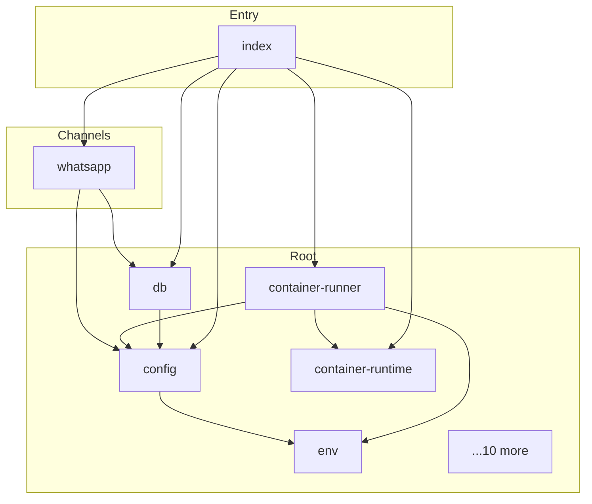

# nanoclaw - Dependency Graph

**Version**: 1.1.0 | **Last Updated**: 2026-05-31

This document provides a comprehensive dependency graph of all files, components, imports, functions, and variables in the codebase.

---

## Table of Contents

1. [Overview](#overview)
2. [Channels Dependencies](#channels-dependencies)
3. [Root Dependencies](#root-dependencies)
4. [Entry Dependencies](#entry-dependencies)
5. [Dependency Matrix](#dependency-matrix)
6. [Circular Dependency Analysis](#circular-dependency-analysis)
7. [Visual Dependency Graph](#visual-dependency-graph)
8. [Summary Statistics](#summary-statistics)

---

## Overview

The codebase is organized into the following modules:

- **channels**: 1 file
- **root**: 15 files
- **entry**: 1 file

---

## Channels Dependencies

### `src/channels/whatsapp.ts` - Sync group metadata from WhatsApp.

**External Dependencies:**
| Package | Import |
|---------|--------|
| `@whiskeysockets/baileys` | `Browsers, DisconnectReason, WASocket, makeCacheableSignalKeyStore, useMultiFileAuthState, makeWASocket` |

**Node.js Built-in Dependencies:**
| Module | Import |
|--------|--------|
| `child_process` | `exec` |
| `fs` | `fs` |
| `path` | `path` |

**Internal Dependencies:**
| File | Imports | Type |
|------|---------|------|
| `../config.js` | `ASSISTANT_HAS_OWN_NUMBER, ASSISTANT_NAME, STORE_DIR` | Import |
| `../db.js` | `getLastGroupSync, setLastGroupSync, updateChatName` | Import |
| `../logger.js` | `logger` | Import |
| `../types.js` | `Channel, OnInboundMessage, OnChatMetadata, RegisteredGroup` | Import |

**Exports:**
- Classes: `WhatsAppChannel`
- Interfaces: `WhatsAppChannelOpts`

---

## Root Dependencies

### `src/config.ts` - Read config values from .env (falls back to process.env).

**Node.js Built-in Dependencies:**
| Module | Import |
|--------|--------|
| `os` | `os` |
| `path` | `path` |

**Internal Dependencies:**
| File | Imports | Type |
|------|---------|------|
| `./env.js` | `readEnvFile` | Import |

**Exports:**
- Constants: `ASSISTANT_NAME`, `ASSISTANT_HAS_OWN_NUMBER`, `POLL_INTERVAL`, `SCHEDULER_POLL_INTERVAL`, `MOUNT_ALLOWLIST_PATH`, `STORE_DIR`, `GROUPS_DIR`, `DATA_DIR`, `MAIN_GROUP_FOLDER`, `CONTAINER_IMAGE`, `CONTAINER_TIMEOUT`, `CONTAINER_MAX_OUTPUT_SIZE`, `IPC_POLL_INTERVAL`, `IDLE_TIMEOUT`, `MAX_CONCURRENT_CONTAINERS`, `TRIGGER_PATTERN`, `TIMEZONE`

---

### `src/container-runner.ts` - Container Runner for NanoClaw

**Node.js Built-in Dependencies:**
| Module | Import |
|--------|--------|
| `child_process` | `ChildProcess, exec, spawn` |
| `fs` | `fs` |
| `path` | `path` |

**Internal Dependencies:**
| File | Imports | Type |
|------|---------|------|
| `./config.js` | `CONTAINER_IMAGE, CONTAINER_MAX_OUTPUT_SIZE, CONTAINER_TIMEOUT, DATA_DIR, GROUPS_DIR, IDLE_TIMEOUT, TIMEZONE` | Import |
| `./env.js` | `readEnvFile` | Import |
| `./fs-sync.js` | `syncDirIfChanged` | Import |
| `./group-folder.js` | `resolveGroupFolderPath, resolveGroupIpcPath` | Import |
| `./logger.js` | `logger` | Import |
| `./container-runtime.js` | `bindMountArgs, getContainerSpawnCommand, isHostMode, stopContainer` | Import |
| `./mount-security.js` | `validateAdditionalMounts` | Import |
| `./types.js` | `RegisteredGroup` | Import |

**Exports:**
- Interfaces: `ContainerInput`, `ContainerOutput`, `AvailableGroup`
- Functions: `runContainerAgent`, `writeTasksSnapshot`, `writeGroupsSnapshot`

---

### `src/container-runtime.ts` - Container runtime abstraction for NanoClaw.

**Node.js Built-in Dependencies:**
| Module | Import |
|--------|--------|
| `child_process` | `execSync` |

**Internal Dependencies:**
| File | Imports | Type |
|------|---------|------|
| `./logger.js` | `logger` | Import |

**Exports:**
- Interfaces: `ResolvedRuntime`
- Functions: `resolveRuntime`, `isHostMode`, `getContainerSpawnCommand`, `normalizeMountSource`, `bindMountArgs`, `readonlyMountArgs`, `stopContainer`, `ensureContainerRuntimeRunning`, `cleanupOrphans`
- Constants: `RUNTIME_KIND`, `CONTAINER_RUNTIME_BIN`

---

### `src/db.ts` - Store chat metadata only (no message content).

**External Dependencies:**
| Package | Import |
|---------|--------|
| `better-sqlite3` | `Database` |

**Node.js Built-in Dependencies:**
| Module | Import |
|--------|--------|
| `fs` | `fs` |
| `path` | `path` |

**Internal Dependencies:**
| File | Imports | Type |
|------|---------|------|
| `./config.js` | `ASSISTANT_NAME, DATA_DIR, STORE_DIR` | Import |
| `./group-folder.js` | `isValidGroupFolder` | Import |
| `./logger.js` | `logger` | Import |
| `./types.js` | `NewMessage, RegisteredGroup, ScheduledTask, TaskRunLog` | Import |

**Exports:**
- Interfaces: `ChatInfo`
- Functions: `initDatabase`, `_initTestDatabase`, `storeChatMetadata`, `updateChatName`, `getAllChats`, `getLastGroupSync`, `setLastGroupSync`, `storeMessage`, `getNewMessages`, `getMessagesSince`, `createTask`, `getTaskById`, `getTasksForGroup`, `getAllTasks`, `updateTask`, `deleteTask`, `getDueTasks`, `updateTaskAfterRun`, `logTaskRun`, `getRouterState`, `setRouterState`, `getSession`, `setSession`, `getAllSessions`, `getRegisteredGroup`, `setRegisteredGroup`, `getAllRegisteredGroups`

---

### `src/env.ts` - Parse the .env file and return values for the requested keys.

**Node.js Built-in Dependencies:**
| Module | Import |
|--------|--------|
| `fs` | `fs` |
| `path` | `path` |

**Internal Dependencies:**
| File | Imports | Type |
|------|---------|------|
| `./logger.js` | `logger` | Import |

**Exports:**
- Functions: `readEnvFile`

---

### `src/fs-sync.ts` - Content-aware directory sync helpers.

**Node.js Built-in Dependencies:**
| Module | Import |
|--------|--------|
| `crypto` | `crypto` |
| `fs` | `fs` |
| `path` | `path` |

**Exports:**
- Functions: `hashDir`, `syncDirIfChanged`

---

### `src/group-folder.ts` - group-folder module

**Node.js Built-in Dependencies:**
| Module | Import |
|--------|--------|
| `path` | `path` |

**Internal Dependencies:**
| File | Imports | Type |
|------|---------|------|
| `./config.js` | `DATA_DIR, GROUPS_DIR` | Import |

**Exports:**
- Functions: `isValidGroupFolder`, `resolveGroupFolderPath`, `resolveGroupIpcPath`

---

### `src/group-queue.ts` - Mark the container as idle-waiting (finished work, waiting for IPC input).

**Node.js Built-in Dependencies:**
| Module | Import |
|--------|--------|
| `child_process` | `ChildProcess` |
| `fs` | `fs` |
| `path` | `path` |

**Internal Dependencies:**
| File | Imports | Type |
|------|---------|------|
| `./config.js` | `MAX_CONCURRENT_CONTAINERS` | Import |
| `./group-folder.js` | `resolveGroupIpcPath` | Import |
| `./logger.js` | `logger` | Import |

**Exports:**
- Classes: `GroupQueue`

---

### `src/ipc.ts` - ipc module

**External Dependencies:**
| Package | Import |
|---------|--------|
| `cron-parser` | `CronExpressionParser` |

**Node.js Built-in Dependencies:**
| Module | Import |
|--------|--------|
| `fs` | `fs` |
| `path` | `path` |

**Internal Dependencies:**
| File | Imports | Type |
|------|---------|------|
| `./config.js` | `DATA_DIR, IPC_POLL_INTERVAL, MAIN_GROUP_FOLDER, TIMEZONE` | Import |
| `./container-runner.js` | `AvailableGroup` | Import |
| `./db.js` | `createTask, deleteTask, getTaskById, updateTask` | Import |
| `./group-folder.js` | `isValidGroupFolder` | Import |
| `./logger.js` | `logger` | Import |
| `./types.js` | `RegisteredGroup` | Import |

**Exports:**
- Interfaces: `IpcDeps`
- Functions: `_resetIpcWatcherForTests`, `startIpcWatcher`, `processTaskIpc`

---

### `src/logger.ts` - Route uncaught errors through pino so they get timestamps in stderr

**External Dependencies:**
| Package | Import |
|---------|--------|
| `pino` | `pino` |

**Exports:**
- Constants: `logger`

---

### `src/mount-security.ts` - Mount Security Module for NanoClaw

**Node.js Built-in Dependencies:**
| Module | Import |
|--------|--------|
| `fs` | `fs` |
| `os` | `os` |
| `path` | `path` |

**Internal Dependencies:**
| File | Imports | Type |
|------|---------|------|
| `./config.js` | `MOUNT_ALLOWLIST_PATH` | Import |
| `./logger.js` | `logger` | Import |
| `./types.js` | `AdditionalMount, AllowedRoot, MountAllowlist` | Import |

**Exports:**
- Interfaces: `MountValidationResult`
- Functions: `loadMountAllowlist`, `_resetMountAllowlistCache`, `hostPathHasDisallowedColon`, `validateMount`, `validateAdditionalMounts`, `generateAllowlistTemplate`

---

### `src/router.ts` - Strip internal-only markup before sending a message outbound.

**Internal Dependencies:**
| File | Imports | Type |
|------|---------|------|
| `./types.js` | `Channel, NewMessage` | Import |

**Exports:**
- Functions: `escapeXml`, `formatMessages`, `stripInternalTags`, `formatOutbound`, `findChannel`

---

### `src/task-scheduler.ts` - task-scheduler module

**External Dependencies:**
| Package | Import |
|---------|--------|
| `cron-parser` | `CronExpressionParser` |

**Node.js Built-in Dependencies:**
| Module | Import |
|--------|--------|
| `child_process` | `ChildProcess` |
| `fs` | `fs` |

**Internal Dependencies:**
| File | Imports | Type |
|------|---------|------|
| `./config.js` | `ASSISTANT_NAME, IDLE_TIMEOUT, MAIN_GROUP_FOLDER, SCHEDULER_POLL_INTERVAL, TIMEZONE` | Import |
| `./container-runner.js` | `ContainerOutput, runContainerAgent, writeTasksSnapshot` | Import |
| `./db.js` | `getAllTasks, getDueTasks, getTaskById, logTaskRun, updateTask, updateTaskAfterRun` | Import |
| `./group-queue.js` | `GroupQueue` | Import |
| `./group-folder.js` | `resolveGroupFolderPath` | Import |
| `./logger.js` | `logger` | Import |
| `./types.js` | `RegisteredGroup, ScheduledTask` | Import |

**Exports:**
- Interfaces: `SchedulerDependencies`
- Functions: `startSchedulerLoop`, `_resetSchedulerLoopForTests`

---

### `src/types.ts` - Mount Allowlist - Security configuration for additional mounts

---

### `src/whatsapp-auth.ts` - WhatsApp Authentication Script

**External Dependencies:**
| Package | Import |
|---------|--------|
| `pino` | `pino` |
| `qrcode-terminal` | `qrcode` |
| `@whiskeysockets/baileys` | `Browsers, DisconnectReason, makeCacheableSignalKeyStore, useMultiFileAuthState, makeWASocket` |

**Node.js Built-in Dependencies:**
| Module | Import |
|--------|--------|
| `fs` | `fs` |
| `path` | `path` |
| `readline` | `readline` |

---

## Entry Dependencies

### `src/index.ts` - Get available groups list for the agent.

**Node.js Built-in Dependencies:**
| Module | Import |
|--------|--------|
| `fs` | `fs` |
| `path` | `path` |

**Internal Dependencies:**
| File | Imports | Type |
|------|---------|------|
| `./config.js` | `ASSISTANT_NAME, IDLE_TIMEOUT, MAIN_GROUP_FOLDER, POLL_INTERVAL, TRIGGER_PATTERN` | Import |
| `./channels/whatsapp.js` | `WhatsAppChannel` | Import |
| `./container-runner.js` | `ContainerOutput, runContainerAgent, writeGroupsSnapshot, writeTasksSnapshot` | Import |
| `./container-runtime.js` | `cleanupOrphans, ensureContainerRuntimeRunning` | Import |
| `./db.js` | `getAllChats, getAllRegisteredGroups, getAllSessions, getAllTasks, getMessagesSince, getNewMessages, getRouterState, initDatabase, setRegisteredGroup, setRouterState, setSession, storeChatMetadata, storeMessage` | Import |
| `./group-queue.js` | `GroupQueue` | Import |
| `./group-folder.js` | `resolveGroupFolderPath` | Import |
| `./ipc.js` | `startIpcWatcher` | Import |
| `./router.js` | `findChannel, formatMessages, formatOutbound` | Import |
| `./task-scheduler.js` | `startSchedulerLoop` | Import |
| `./types.js` | `Channel, NewMessage, RegisteredGroup` | Import |
| `./logger.js` | `logger` | Import |

**Exports:**
- Functions: `getAvailableGroups`, `_setRegisteredGroups`

---

## Dependency Matrix

### File Import/Export Matrix

| File | Imports From | Exports To |
|------|--------------|------------|
| `whatsapp` | 4 files | 1 files |
| `config` | 1 files | 9 files |
| `container-runner` | 8 files | 3 files |
| `container-runtime` | 1 files | 2 files |
| `db` | 4 files | 4 files |
| `env` | 1 files | 2 files |
| `fs-sync` | 0 files | 1 files |
| `group-folder` | 1 files | 6 files |
| `group-queue` | 3 files | 2 files |
| `index` | 12 files | 0 files |
| `ipc` | 6 files | 1 files |
| `logger` | 0 files | 10 files |
| `mount-security` | 3 files | 1 files |
| `router` | 1 files | 1 files |
| `task-scheduler` | 7 files | 1 files |
| `types` | 0 files | 8 files |
| `whatsapp-auth` | 0 files | 0 files |

---

## Circular Dependency Analysis

**No circular dependencies detected.**
---

## Visual Dependency Graph

---

## Summary Statistics

| Category | Count |
|----------|-------|
| Total TypeScript Files | 17 |
| Total Modules | 3 |
| Total Lines of Code | 4614 |
| Total Exports | 85 |
| Total Re-exports | 0 |
| Total Classes | 2 |
| Total Interfaces | 18 |
| Total Functions | 63 |
| Total Type Guards | 2 |
| Total Enums | 0 |
| Type-only Imports | 0 |
| Runtime Circular Deps | 0 |
| Type-only Circular Deps | 0 |

---

*Last Updated*: 2026-05-31
*Version*: 1.1.0
