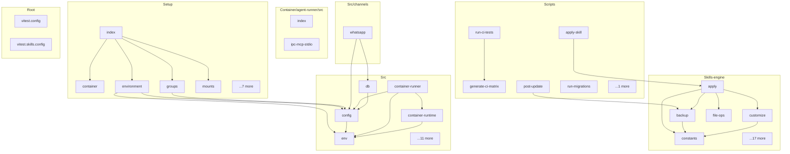

# nanoclaw - Dependency Graph

**Version**: 1.1.0 | **Last Updated**: 2026-06-01

This document provides a comprehensive dependency graph of all files, components, imports, functions, and variables in the codebase.

---

## Table of Contents

1. [Overview](#overview)
2. [Container/agent runner/src Dependencies](#container/agent-runner/src-dependencies)
3. [Scripts Dependencies](#scripts-dependencies)
4. [Setup Dependencies](#setup-dependencies)
5. [Skills engine Dependencies](#skills-engine-dependencies)
6. [Src/channels Dependencies](#src/channels-dependencies)
7. [Src Dependencies](#src-dependencies)
8. [Root Dependencies](#root-dependencies)
9. [Dependency Matrix](#dependency-matrix)
10. [Circular Dependency Analysis](#circular-dependency-analysis)
11. [Visual Dependency Graph](#visual-dependency-graph)
12. [Summary Statistics](#summary-statistics)

---

## Overview

The codebase is organized into the following modules:

- **container/agent-runner/src**: 2 files
- **scripts**: 6 files
- **setup**: 12 files
- **skills-engine**: 22 files
- **src/channels**: 1 file
- **src**: 16 files
- **root**: 2 files

---

## Container/agent runner/src Dependencies

### `container/agent-runner/src/index.ts` - NanoClaw Agent Runner

**External Dependencies:**
| Package | Import |
|---------|--------|
| `@anthropic-ai/claude-agent-sdk` | `query, HookCallback, PreCompactHookInput, PreToolUseHookInput` |

**Node.js Built-in Dependencies:**
| Module | Import |
|--------|--------|
| `fs` | `fs` |
| `path` | `path` |
| `url` | `fileURLToPath` |

---

### `container/agent-runner/src/ipc-mcp-stdio.ts` - Stdio MCP Server for NanoClaw

**External Dependencies:**
| Package | Import |
|---------|--------|
| `@modelcontextprotocol/sdk/server/mcp.js` | `McpServer` |
| `@modelcontextprotocol/sdk/server/stdio.js` | `StdioServerTransport` |
| `zod` | `z` |
| `cron-parser` | `CronExpressionParser` |

**Node.js Built-in Dependencies:**
| Module | Import |
|--------|--------|
| `fs` | `fs` |
| `path` | `path` |

---

## Scripts Dependencies

### `scripts/apply-skill.ts` - apply-skill module

**Internal Dependencies:**
| File | Imports | Type |
|------|---------|------|
| `../skills-engine/apply.js` | `applySkill` | Import |

---

### `scripts/generate-ci-matrix.ts` - Extract overlap-relevant info from a parsed manifest.

**External Dependencies:**
| Package | Import |
|---------|--------|
| `yaml` | `parse` |

**Node.js Built-in Dependencies:**
| Module | Import |
|--------|--------|
| `fs` | `fs` |
| `path` | `path` |

**Internal Dependencies:**
| File | Imports | Type |
|------|---------|------|
| `../skills-engine/types.js` | `SkillManifest` | Import |

**Exports:**
- Interfaces: `MatrixEntry`, `SkillOverlapInfo`
- Functions: `extractOverlapInfo`, `computeOverlapMatrix`, `readAllManifests`, `generateMatrix`

---

### `scripts/post-update.ts` - post-update module

**Internal Dependencies:**
| File | Imports | Type |
|------|---------|------|
| `../skills-engine/backup.js` | `clearBackup` | Import |

---

### `scripts/run-ci-tests.ts` - --- Main ---

**Node.js Built-in Dependencies:**
| Module | Import |
|--------|--------|
| `child_process` | `execSync` |
| `fs` | `fs` |
| `os` | `os` |
| `path` | `path` |

**Internal Dependencies:**
| File | Imports | Type |
|------|---------|------|
| `./generate-ci-matrix.js` | `generateMatrix, MatrixEntry` | Import |
| `../skills-engine/fs-utils.js` | `copyDir` | Import |

---

### `scripts/run-migrations.ts` - Resolve tsx's ESM loader once so each migration runs under TypeScript on any

**Node.js Built-in Dependencies:**
| Module | Import |
|--------|--------|
| `child_process` | `execFileSync` |
| `fs` | `fs` |
| `module` | `createRequire` |
| `path` | `path` |
| `url` | `pathToFileURL` |

**Internal Dependencies:**
| File | Imports | Type |
|------|---------|------|
| `../skills-engine/state.js` | `compareSemver` | Import |

---

### `scripts/update-core.ts` - Preview

**Internal Dependencies:**
| File | Imports | Type |
|------|---------|------|
| `../skills-engine/update.js` | `applyUpdate, previewUpdate` | Import |

---

## Setup Dependencies

### `setup/container.ts` - Step: container — Build container image and verify with test run.

**Node.js Built-in Dependencies:**
| Module | Import |
|--------|--------|
| `child_process` | `execSync` |
| `path` | `path` |

**Internal Dependencies:**
| File | Imports | Type |
|------|---------|------|
| `../src/logger.js` | `logger` | Import |
| `./platform.js` | `commandExists` | Import |
| `./status.js` | `emitStatus` | Import |

**Exports:**
- Functions: `run`

---

### `setup/environment.ts` - Step: environment — Detect OS, Node, container runtimes, existing config.

**External Dependencies:**
| Package | Import |
|---------|--------|
| `better-sqlite3` | `Database` |

**Node.js Built-in Dependencies:**
| Module | Import |
|--------|--------|
| `fs` | `fs` |
| `path` | `path` |

**Internal Dependencies:**
| File | Imports | Type |
|------|---------|------|
| `../src/config.js` | `STORE_DIR` | Import |
| `../src/logger.js` | `logger` | Import |
| `./platform.js` | `commandExists, getPlatform, isHeadless, isWSL` | Import |
| `./status.js` | `emitStatus` | Import |
| `../src/env.js` | `(dynamic)` | Import |

**Exports:**
- Functions: `run`

---

### `setup/groups.ts` - Step: groups — Connect to WhatsApp, fetch group metadata, write to DB.

**External Dependencies:**
| Package | Import |
|---------|--------|
| `better-sqlite3` | `Database` |
| `@whiskeysockets/baileys` | `useMultiFileAuthState, makeCacheableSignalKeyStore, Browsers, makeWASocket` |
| `pino` | `pino` |
| `better-sqlite3` | `Database` |

**Node.js Built-in Dependencies:**
| Module | Import |
|--------|--------|
| `child_process` | `execSync` |
| `fs` | `fs` |
| `path` | `path` |
| `path` | `path` |
| `fs` | `fs` |

**Internal Dependencies:**
| File | Imports | Type |
|------|---------|------|
| `../src/config.js` | `STORE_DIR` | Import |
| `../src/logger.js` | `logger` | Import |
| `./node-script.js` | `runNodeScript` | Import |
| `./status.js` | `emitStatus` | Import |

**Exports:**
- Functions: `run`

---

### `setup/index.ts` - Setup CLI entry point.

**Internal Dependencies:**
| File | Imports | Type |
|------|---------|------|
| `../src/logger.js` | `logger` | Import |
| `./status.js` | `emitStatus` | Import |
| `./environment.js` | `(dynamic)` | Import |
| `./container.js` | `(dynamic)` | Import |
| `./whatsapp-auth.js` | `(dynamic)` | Import |
| `./groups.js` | `(dynamic)` | Import |
| `./register.js` | `(dynamic)` | Import |
| `./mounts.js` | `(dynamic)` | Import |
| `./service.js` | `(dynamic)` | Import |
| `./verify.js` | `(dynamic)` | Import |

---

### `setup/mounts.ts` - Step: mounts — Write mount allowlist config file.

**Node.js Built-in Dependencies:**
| Module | Import |
|--------|--------|
| `fs` | `fs` |
| `path` | `path` |
| `os` | `os` |

**Internal Dependencies:**
| File | Imports | Type |
|------|---------|------|
| `../src/logger.js` | `logger` | Import |
| `./platform.js` | `isRoot` | Import |
| `./status.js` | `emitStatus` | Import |

**Exports:**
- Functions: `run`

---

### `setup/node-script.ts` - Shared helpers for running Node.js scripts from setup steps in a

**Node.js Built-in Dependencies:**
| Module | Import |
|--------|--------|
| `child_process` | `execFileSync` |
| `fs` | `fs` |
| `path` | `path` |

**Exports:**
- Functions: `runNodeScript`

---

### `setup/platform.ts` - Cross-platform detection utilities for NanoClaw setup.

**Node.js Built-in Dependencies:**
| Module | Import |
|--------|--------|
| `child_process` | `execSync` |
| `fs` | `fs` |
| `os` | `os` |

**Exports:**
- Functions: `getPlatform`, `isWindows`, `isWSL`, `isRoot`, `isHeadless`, `hasSystemd`, `openBrowser`, `getServiceManager`, `getNodePath`, `commandExists`, `getNodeVersion`, `getNodeMajorVersion`

---

### `setup/register.ts` - Step: register — Write channel registration config, create group folders.

**Node.js Built-in Dependencies:**
| Module | Import |
|--------|--------|
| `fs` | `fs` |
| `path` | `path` |

**Internal Dependencies:**
| File | Imports | Type |
|------|---------|------|
| `../src/db.js` | `initDatabase, setRegisteredGroup` | Import |
| `../src/group-folder.js` | `isValidGroupFolder` | Import |
| `../src/logger.js` | `logger` | Import |
| `./status.js` | `emitStatus` | Import |

**Exports:**
- Functions: `run`

---

### `setup/service.ts` - Step: service — Generate and load service manager config.

**Node.js Built-in Dependencies:**
| Module | Import |
|--------|--------|
| `child_process` | `execFileSync, execSync` |
| `fs` | `fs` |
| `os` | `os` |
| `path` | `path` |

**Internal Dependencies:**
| File | Imports | Type |
|------|---------|------|
| `../src/logger.js` | `logger` | Import |
| `./platform.js` | `getPlatform, getNodePath, getServiceManager, isRoot` | Import |
| `./status.js` | `emitStatus` | Import |

**Exports:**
- Functions: `run`, `generateWindowsLauncher`, `windowsScheduledTaskArgs`
- Constants: `WINDOWS_TASK_NAME`

---

### `setup/status.ts` - Structured status block output for setup steps.

**Exports:**
- Functions: `emitStatus`

---

### `setup/verify.ts` - Step: verify — End-to-end health check of the full installation.

**External Dependencies:**
| Package | Import |
|---------|--------|
| `better-sqlite3` | `Database` |

**Node.js Built-in Dependencies:**
| Module | Import |
|--------|--------|
| `child_process` | `execSync` |
| `fs` | `fs` |
| `os` | `os` |
| `path` | `path` |

**Internal Dependencies:**
| File | Imports | Type |
|------|---------|------|
| `../src/config.js` | `STORE_DIR` | Import |
| `../src/logger.js` | `logger` | Import |
| `./platform.js` | `commandExists, getServiceManager, isRoot` | Import |
| `./status.js` | `emitStatus` | Import |

**Exports:**
- Functions: `run`

---

### `setup/whatsapp-auth.ts` - Step: whatsapp-auth — Full WhatsApp auth flow with polling.

**External Dependencies:**
| Package | Import |
|---------|--------|
| `qrcode` | `QR` |

**Node.js Built-in Dependencies:**
| Module | Import |
|--------|--------|
| `child_process` | `spawn` |
| `fs` | `fs` |
| `path` | `path` |
| `fs` | `fs` |

**Internal Dependencies:**
| File | Imports | Type |
|------|---------|------|
| `../src/logger.js` | `logger` | Import |
| `./node-script.js` | `runNodeScript` | Import |
| `./platform.js` | `openBrowser, isHeadless` | Import |
| `./status.js` | `emitStatus` | Import |

**Exports:**
- Functions: `run`

---

## Skills engine Dependencies

### `skills-engine/apply.ts` - apply module

**Node.js Built-in Dependencies:**
| Module | Import |
|--------|--------|
| `child_process` | `execFileSync, execSync` |
| `crypto` | `crypto` |
| `fs` | `fs` |
| `os` | `os` |
| `path` | `path` |

**Internal Dependencies:**
| File | Imports | Type |
|------|---------|------|
| `./backup.js` | `clearBackup, createBackup, restoreBackup` | Import |
| `./constants.js` | `NANOCLAW_DIR` | Import |
| `./fs-utils.js` | `copyDir` | Import |
| `./customize.js` | `isCustomizeActive` | Import |
| `./file-ops.js` | `executeFileOps` | Import |
| `./lock.js` | `acquireLock` | Import |
| `./manifest.js` | `checkConflicts, checkCoreVersion, checkDependencies, checkSystemVersion, readManifest` | Import |
| `./path-remap.js` | `loadPathRemap, resolvePathRemap` | Import |
| `./merge.js` | `cleanupMergeState, isGitRepo, mergeFile, runRerere, setupRerereAdapter` | Import |
| `./resolution-cache.js` | `loadResolutions` | Import |
| `./state.js` | `computeFileHash, readState, recordSkillApplication, writeState` | Import |
| `./structured.js` | `mergeDockerComposeServices, mergeEnvAdditions, mergeNpmDependencies, runNpmInstall` | Import |
| `./types.js` | `ApplyResult` | Import |

**Exports:**
- Functions: `applySkill`

---

### `skills-engine/backup.ts` - backup module

**Node.js Built-in Dependencies:**
| Module | Import |
|--------|--------|
| `fs` | `fs` |
| `path` | `path` |

**Internal Dependencies:**
| File | Imports | Type |
|------|---------|------|
| `./constants.js` | `BACKUP_DIR` | Import |

**Exports:**
- Functions: `createBackup`, `restoreBackup`, `clearBackup`

---

### `skills-engine/constants.ts` - Top-level paths to include in base snapshot and upstream extraction.

**Exports:**
- Constants: `NANOCLAW_DIR`, `STATE_FILE`, `BASE_DIR`, `BACKUP_DIR`, `LOCK_FILE`, `CUSTOM_DIR`, `RESOLUTIONS_DIR`, `SHIPPED_RESOLUTIONS_DIR`, `SKILLS_SCHEMA_VERSION`, `BASE_INCLUDES`, `BASE_EXCLUDES`

---

### `skills-engine/customize.ts` - customize module

**External Dependencies:**
| Package | Import |
|---------|--------|
| `yaml` | `parse, stringify` |

**Node.js Built-in Dependencies:**
| Module | Import |
|--------|--------|
| `fs` | `fs` |
| `path` | `path` |

**Internal Dependencies:**
| File | Imports | Type |
|------|---------|------|
| `./constants.js` | `BASE_DIR, CUSTOM_DIR` | Import |
| `./git-utils.js` | `gitDiffNoIndex` | Import |
| `./state.js` | `computeFileHash, readState, recordCustomModification` | Import |

**Exports:**
- Functions: `isCustomizeActive`, `startCustomize`, `commitCustomize`, `abortCustomize`

---

### `skills-engine/file-ops.ts` - file-ops module

**Node.js Built-in Dependencies:**
| Module | Import |
|--------|--------|
| `fs` | `fs` |
| `path` | `path` |

**Internal Dependencies:**
| File | Imports | Type |
|------|---------|------|
| `./types.js` | `FileOperation, FileOpsResult` | Import (type-only) |

**Exports:**
- Functions: `executeFileOps`

---

### `skills-engine/fs-utils.ts` - Normalize a path to POSIX (forward-slash) separators.

**Node.js Built-in Dependencies:**
| Module | Import |
|--------|--------|
| `fs` | `fs` |
| `path` | `path` |

**Exports:**
- Functions: `toPosix`, `copyDir`

---

### `skills-engine/git-utils.ts` - Run `git diff --no-index` on the given path arguments (resolved relative to

**Node.js Built-in Dependencies:**
| Module | Import |
|--------|--------|
| `child_process` | `execFileSync` |

**Exports:**
- Functions: `gitDiffNoIndex`

---

### `skills-engine/index.ts` - index module

**Internal Dependencies:**
| File | Imports | Type |
|------|---------|------|
| `./apply.js` | `applySkill` | Re-export |
| `./backup.js` | `clearBackup, createBackup, restoreBackup` | Re-export |
| `./constants.js` | `BACKUP_DIR, BASE_DIR, SKILLS_SCHEMA_VERSION, CUSTOM_DIR, LOCK_FILE, NANOCLAW_DIR, RESOLUTIONS_DIR, SHIPPED_RESOLUTIONS_DIR, STATE_FILE` | Re-export |
| `./customize.js` | `abortCustomize, commitCustomize, isCustomizeActive, startCustomize` | Re-export |
| `./file-ops.js` | `executeFileOps` | Re-export |
| `./init.js` | `initNanoclawDir` | Re-export |
| `./lock.js` | `acquireLock, isLocked, releaseLock` | Re-export |
| `./manifest.js` | `checkConflicts, checkCoreVersion, checkDependencies, checkSystemVersion, readManifest` | Re-export |
| `./merge.js` | `cleanupMergeState, isGitRepo, mergeFile, runRerere, setupRerereAdapter` | Re-export |
| `./path-remap.js` | `loadPathRemap, recordPathRemap, resolvePathRemap` | Re-export |
| `./rebase.js` | `rebase` | Re-export |
| `./replay.js` | `findSkillDir, replaySkills` | Re-export |
| `./uninstall.js` | `uninstallSkill` | Re-export |
| `./migrate.js` | `initSkillsSystem, migrateExisting` | Re-export |
| `./resolution-cache.js` | `clearAllResolutions, findResolutionDir, loadResolutions, saveResolution` | Re-export |
| `./update.js` | `applyUpdate, previewUpdate` | Re-export |
| `./state.js` | `compareSemver, computeFileHash, getAppliedSkills, getCustomModifications, readState, recordCustomModification, recordSkillApplication, writeState` | Re-export |
| `./structured.js` | `areRangesCompatible, mergeDockerComposeServices, mergeEnvAdditions, mergeNpmDependencies, runNpmInstall` | Re-export |

**Exports:**
- Re-exports: `applySkill`, `clearBackup`, `createBackup`, `restoreBackup`, `BACKUP_DIR`, `BASE_DIR`, `SKILLS_SCHEMA_VERSION`, `CUSTOM_DIR`, `LOCK_FILE`, `NANOCLAW_DIR`, `RESOLUTIONS_DIR`, `SHIPPED_RESOLUTIONS_DIR`, `STATE_FILE`, `abortCustomize`, `commitCustomize`, `isCustomizeActive`, `startCustomize`, `executeFileOps`, `initNanoclawDir`, `acquireLock`, `isLocked`, `releaseLock`, `checkConflicts`, `checkCoreVersion`, `checkDependencies`, `checkSystemVersion`, `readManifest`, `cleanupMergeState`, `isGitRepo`, `mergeFile`, `runRerere`, `setupRerereAdapter`, `loadPathRemap`, `recordPathRemap`, `resolvePathRemap`, `rebase`, `findSkillDir`, `replaySkills`, `uninstallSkill`, `initSkillsSystem`, `migrateExisting`, `clearAllResolutions`, `findResolutionDir`, `loadResolutions`, `saveResolution`, `applyUpdate`, `previewUpdate`, `compareSemver`, `computeFileHash`, `getAppliedSkills`, `getCustomModifications`, `readState`, `recordCustomModification`, `recordSkillApplication`, `writeState`, `areRangesCompatible`, `mergeDockerComposeServices`, `mergeEnvAdditions`, `mergeNpmDependencies`, `runNpmInstall`

---

### `skills-engine/init.ts` - init module

**Node.js Built-in Dependencies:**
| Module | Import |
|--------|--------|
| `child_process` | `execSync` |
| `fs` | `fs` |
| `path` | `path` |

**Internal Dependencies:**
| File | Imports | Type |
|------|---------|------|
| `./constants.js` | `BACKUP_DIR, BASE_DIR, BASE_EXCLUDES, BASE_INCLUDES, NANOCLAW_DIR` | Import |
| `./fs-utils.js` | `copyDir` | Import |
| `./merge.js` | `isGitRepo` | Import |
| `./state.js` | `writeState` | Import |
| `./types.js` | `SkillState` | Import |

**Exports:**
- Functions: `initNanoclawDir`

---

### `skills-engine/lock.ts` - lock module

**Node.js Built-in Dependencies:**
| Module | Import |
|--------|--------|
| `fs` | `fs` |
| `path` | `path` |

**Internal Dependencies:**
| File | Imports | Type |
|------|---------|------|
| `./constants.js` | `LOCK_FILE` | Import |

**Exports:**
- Functions: `acquireLock`, `releaseLock`, `isLocked`

---

### `skills-engine/manifest.ts` - manifest module

**External Dependencies:**
| Package | Import |
|---------|--------|
| `yaml` | `parse` |

**Node.js Built-in Dependencies:**
| Module | Import |
|--------|--------|
| `fs` | `fs` |
| `path` | `path` |

**Internal Dependencies:**
| File | Imports | Type |
|------|---------|------|
| `./constants.js` | `SKILLS_SCHEMA_VERSION` | Import |
| `./state.js` | `getAppliedSkills, readState, compareSemver` | Import |
| `./types.js` | `SkillManifest` | Import |

**Exports:**
- Functions: `readManifest`, `checkCoreVersion`, `checkDependencies`, `checkSystemVersion`, `checkConflicts`

---

### `skills-engine/merge.ts` - Run git merge-file to three-way merge files.

**Node.js Built-in Dependencies:**
| Module | Import |
|--------|--------|
| `child_process` | `execFileSync, execSync` |
| `fs` | `fs` |
| `path` | `path` |

**Internal Dependencies:**
| File | Imports | Type |
|------|---------|------|
| `./types.js` | `MergeResult` | Import |

**Exports:**
- Functions: `isGitRepo`, `mergeFile`, `setupRerereAdapter`, `runRerere`, `cleanupMergeState`

---

### `skills-engine/migrate.ts` - migrate module

**Node.js Built-in Dependencies:**
| Module | Import |
|--------|--------|
| `fs` | `fs` |
| `path` | `path` |

**Internal Dependencies:**
| File | Imports | Type |
|------|---------|------|
| `./constants.js` | `BASE_DIR, CUSTOM_DIR, NANOCLAW_DIR` | Import |
| `./git-utils.js` | `gitDiffNoIndex` | Import |
| `./init.js` | `initNanoclawDir` | Import |
| `./state.js` | `recordCustomModification` | Import |

**Exports:**
- Functions: `initSkillsSystem`, `migrateExisting`

---

### `skills-engine/path-remap.ts` - path-remap module

**Node.js Built-in Dependencies:**
| Module | Import |
|--------|--------|
| `fs` | `fs` |
| `path` | `path` |

**Internal Dependencies:**
| File | Imports | Type |
|------|---------|------|
| `./fs-utils.js` | `toPosix` | Import |
| `./state.js` | `readState, writeState` | Import |

**Exports:**
- Functions: `resolvePathRemap`, `loadPathRemap`, `recordPathRemap`

---

### `skills-engine/rebase.ts` - rebase module

**Node.js Built-in Dependencies:**
| Module | Import |
|--------|--------|
| `child_process` | `execFileSync, execSync` |
| `crypto` | `crypto` |
| `fs` | `fs` |
| `os` | `os` |
| `path` | `path` |

**Internal Dependencies:**
| File | Imports | Type |
|------|---------|------|
| `./backup.js` | `clearBackup, createBackup, restoreBackup` | Import |
| `./constants.js` | `BASE_DIR, BASE_EXCLUDES, NANOCLAW_DIR` | Import |
| `./fs-utils.js` | `copyDir, toPosix` | Import |
| `./git-utils.js` | `gitDiffNoIndex` | Import |
| `./lock.js` | `acquireLock` | Import |
| `./merge.js` | `cleanupMergeState, isGitRepo, mergeFile, runRerere, setupRerereAdapter` | Import |
| `./resolution-cache.js` | `clearAllResolutions` | Import |
| `./state.js` | `computeFileHash, readState, writeState` | Import |
| `./types.js` | `RebaseResult` | Import (type-only) |

**Exports:**
- Functions: `rebase`

---

### `skills-engine/replay.ts` - Scan .claude/skills/ for a directory whose manifest.yaml has skill: <skillName>.

**Node.js Built-in Dependencies:**
| Module | Import |
|--------|--------|
| `child_process` | `execFileSync, execSync` |
| `crypto` | `crypto` |
| `fs` | `fs` |
| `os` | `os` |
| `path` | `path` |

**Internal Dependencies:**
| File | Imports | Type |
|------|---------|------|
| `./constants.js` | `BASE_DIR, NANOCLAW_DIR` | Import |
| `./fs-utils.js` | `copyDir` | Import |
| `./manifest.js` | `readManifest` | Import |
| `./merge.js` | `cleanupMergeState, isGitRepo, mergeFile, runRerere, setupRerereAdapter` | Import |
| `./path-remap.js` | `loadPathRemap, resolvePathRemap` | Import |
| `./resolution-cache.js` | `loadResolutions` | Import |
| `./structured.js` | `mergeDockerComposeServices, mergeEnvAdditions, mergeNpmDependencies, runNpmInstall` | Import |
| `./file-ops.js` | `(dynamic)` | Import |

**Exports:**
- Interfaces: `ReplayOptions`, `ReplayResult`
- Functions: `findSkillDir`, `replaySkills`

---

### `skills-engine/resolution-cache.ts` - Build the resolution directory key from a set of skill identifiers.

**External Dependencies:**
| Package | Import |
|---------|--------|
| `yaml` | `parse, stringify` |

**Node.js Built-in Dependencies:**
| Module | Import |
|--------|--------|
| `child_process` | `execSync` |
| `fs` | `fs` |
| `path` | `path` |

**Internal Dependencies:**
| File | Imports | Type |
|------|---------|------|
| `./constants.js` | `NANOCLAW_DIR, RESOLUTIONS_DIR, SHIPPED_RESOLUTIONS_DIR` | Import |
| `./fs-utils.js` | `toPosix` | Import |
| `./state.js` | `computeFileHash` | Import |
| `./types.js` | `FileInputHashes, ResolutionMeta` | Import |

**Exports:**
- Functions: `findResolutionDir`, `loadResolutions`, `saveResolution`, `clearAllResolutions`

---

### `skills-engine/state.ts` - Compare two semver strings. Returns negative if a < b, 0 if equal, positive if a > b.

**External Dependencies:**
| Package | Import |
|---------|--------|
| `yaml` | `parse, stringify` |

**Node.js Built-in Dependencies:**
| Module | Import |
|--------|--------|
| `crypto` | `crypto` |
| `fs` | `fs` |
| `path` | `path` |

**Internal Dependencies:**
| File | Imports | Type |
|------|---------|------|
| `./constants.js` | `SKILLS_SCHEMA_VERSION, NANOCLAW_DIR, STATE_FILE` | Import |
| `./types.js` | `AppliedSkill, CustomModification, SkillState` | Import |

**Exports:**
- Functions: `readState`, `writeState`, `recordSkillApplication`, `getAppliedSkills`, `recordCustomModification`, `getCustomModifications`, `computeFileHash`, `compareSemver`

---

### `skills-engine/structured.ts` - structured module

**External Dependencies:**
| Package | Import |
|---------|--------|
| `yaml` | `parse, stringify` |

**Node.js Built-in Dependencies:**
| Module | Import |
|--------|--------|
| `child_process` | `execSync` |
| `fs` | `fs` |

**Exports:**
- Functions: `areRangesCompatible`, `mergeNpmDependencies`, `mergeEnvAdditions`, `mergeDockerComposeServices`, `runNpmInstall`

---

### `skills-engine/types.ts` - types module

---

### `skills-engine/uninstall.ts` - uninstall module

**Node.js Built-in Dependencies:**
| Module | Import |
|--------|--------|
| `child_process` | `execFileSync, execSync` |
| `fs` | `fs` |
| `path` | `path` |

**Internal Dependencies:**
| File | Imports | Type |
|------|---------|------|
| `./backup.js` | `clearBackup, createBackup, restoreBackup` | Import |
| `./constants.js` | `BASE_DIR, NANOCLAW_DIR` | Import |
| `./lock.js` | `acquireLock` | Import |
| `./path-remap.js` | `loadPathRemap, resolvePathRemap` | Import |
| `./state.js` | `computeFileHash, readState, writeState` | Import |
| `./replay.js` | `findSkillDir, replaySkills` | Import |
| `./types.js` | `UninstallResult` | Import (type-only) |

**Exports:**
- Functions: `uninstallSkill`

---

### `skills-engine/update.ts` - update module

**External Dependencies:**
| Package | Import |
|---------|--------|
| `yaml` | `parse` |

**Node.js Built-in Dependencies:**
| Module | Import |
|--------|--------|
| `child_process` | `execFileSync, execSync` |
| `crypto` | `crypto` |
| `fs` | `fs` |
| `os` | `os` |
| `path` | `path` |

**Internal Dependencies:**
| File | Imports | Type |
|------|---------|------|
| `./backup.js` | `clearBackup, createBackup, restoreBackup` | Import |
| `./constants.js` | `BASE_DIR, BASE_EXCLUDES, NANOCLAW_DIR` | Import |
| `./fs-utils.js` | `copyDir, toPosix` | Import |
| `./customize.js` | `isCustomizeActive` | Import |
| `./lock.js` | `acquireLock` | Import |
| `./merge.js` | `cleanupMergeState, isGitRepo, mergeFile, runRerere, setupRerereAdapter` | Import |
| `./path-remap.js` | `recordPathRemap` | Import |
| `./state.js` | `computeFileHash, readState, writeState` | Import |
| `./structured.js` | `mergeDockerComposeServices, mergeEnvAdditions, mergeNpmDependencies, runNpmInstall` | Import |
| `./types.js` | `UpdatePreview, UpdateResult` | Import (type-only) |

**Exports:**
- Functions: `previewUpdate`, `applyUpdate`

---

## Src/channels Dependencies

### `src/channels/whatsapp.ts` - Sync group metadata from WhatsApp.

**External Dependencies:**
| Package | Import |
|---------|--------|
| `@whiskeysockets/baileys` | `Browsers, DisconnectReason, WASocket, makeCacheableSignalKeyStore, useMultiFileAuthState, makeWASocket` |

**Node.js Built-in Dependencies:**
| Module | Import |
|--------|--------|
| `child_process` | `exec` |
| `fs` | `fs` |
| `path` | `path` |

**Internal Dependencies:**
| File | Imports | Type |
|------|---------|------|
| `../config.js` | `ASSISTANT_HAS_OWN_NUMBER, ASSISTANT_NAME, STORE_DIR` | Import |
| `../db.js` | `getLastGroupSync, setLastGroupSync, updateChatName` | Import |
| `../logger.js` | `logger` | Import |
| `../types.js` | `Channel, OnInboundMessage, OnChatMetadata, RegisteredGroup` | Import |

**Exports:**
- Classes: `WhatsAppChannel`
- Interfaces: `WhatsAppChannelOpts`

---

## Src Dependencies

### `src/config.ts` - Read config values from .env (falls back to process.env).

**Node.js Built-in Dependencies:**
| Module | Import |
|--------|--------|
| `os` | `os` |
| `path` | `path` |

**Internal Dependencies:**
| File | Imports | Type |
|------|---------|------|
| `./env.js` | `readEnvFile` | Import |

**Exports:**
- Constants: `ASSISTANT_NAME`, `ASSISTANT_HAS_OWN_NUMBER`, `POLL_INTERVAL`, `SCHEDULER_POLL_INTERVAL`, `MOUNT_ALLOWLIST_PATH`, `STORE_DIR`, `GROUPS_DIR`, `DATA_DIR`, `MAIN_GROUP_FOLDER`, `CONTAINER_IMAGE`, `CONTAINER_TIMEOUT`, `CONTAINER_MAX_OUTPUT_SIZE`, `IPC_POLL_INTERVAL`, `IDLE_TIMEOUT`, `MAX_CONCURRENT_CONTAINERS`, `TRIGGER_PATTERN`, `TIMEZONE`

---

### `src/container-runner.ts` - Container Runner for NanoClaw

**Node.js Built-in Dependencies:**
| Module | Import |
|--------|--------|
| `child_process` | `ChildProcess, exec, spawn` |
| `fs` | `fs` |
| `path` | `path` |

**Internal Dependencies:**
| File | Imports | Type |
|------|---------|------|
| `./config.js` | `CONTAINER_IMAGE, CONTAINER_MAX_OUTPUT_SIZE, CONTAINER_TIMEOUT, DATA_DIR, GROUPS_DIR, IDLE_TIMEOUT, TIMEZONE` | Import |
| `./env.js` | `readEnvFile` | Import |
| `./fs-sync.js` | `syncDirIfChanged` | Import |
| `./group-folder.js` | `resolveGroupFolderPath, resolveGroupIpcPath` | Import |
| `./logger.js` | `logger` | Import |
| `./container-runtime.js` | `bindMountArgs, getContainerSpawnCommand, isHostMode, stopContainer` | Import |
| `./mount-security.js` | `validateAdditionalMounts` | Import |
| `./types.js` | `RegisteredGroup` | Import |

**Exports:**
- Interfaces: `ContainerInput`, `ContainerOutput`, `AvailableGroup`
- Functions: `runContainerAgent`, `writeTasksSnapshot`, `writeGroupsSnapshot`

---

### `src/container-runtime.ts` - Container runtime abstraction for NanoClaw.

**Node.js Built-in Dependencies:**
| Module | Import |
|--------|--------|
| `child_process` | `execSync` |

**Internal Dependencies:**
| File | Imports | Type |
|------|---------|------|
| `./env.js` | `readEnvFile` | Import |
| `./logger.js` | `logger` | Import |

**Exports:**
- Interfaces: `ResolvedRuntime`
- Functions: `resolveRuntime`, `isHostMode`, `getContainerSpawnCommand`, `normalizeMountSource`, `bindMountArgs`, `readonlyMountArgs`, `stopContainer`, `ensureContainerRuntimeRunning`, `cleanupOrphans`
- Constants: `RUNTIME_KIND`, `CONTAINER_RUNTIME_BIN`

---

### `src/db.ts` - Store chat metadata only (no message content).

**External Dependencies:**
| Package | Import |
|---------|--------|
| `better-sqlite3` | `Database` |

**Node.js Built-in Dependencies:**
| Module | Import |
|--------|--------|
| `fs` | `fs` |
| `path` | `path` |

**Internal Dependencies:**
| File | Imports | Type |
|------|---------|------|
| `./config.js` | `ASSISTANT_NAME, DATA_DIR, STORE_DIR` | Import |
| `./group-folder.js` | `isValidGroupFolder` | Import |
| `./logger.js` | `logger` | Import |
| `./types.js` | `NewMessage, RegisteredGroup, ScheduledTask, TaskRunLog` | Import |

**Exports:**
- Interfaces: `ChatInfo`
- Functions: `initDatabase`, `_initTestDatabase`, `storeChatMetadata`, `updateChatName`, `getAllChats`, `getLastGroupSync`, `setLastGroupSync`, `storeMessage`, `getNewMessages`, `getMessagesSince`, `createTask`, `getTaskById`, `getTasksForGroup`, `getAllTasks`, `updateTask`, `deleteTask`, `getDueTasks`, `updateTaskAfterRun`, `logTaskRun`, `getRouterState`, `setRouterState`, `getSession`, `setSession`, `getAllSessions`, `getRegisteredGroup`, `setRegisteredGroup`, `getAllRegisteredGroups`
- Constants: `buildMessageCursor`

---

### `src/env.ts` - Parse the .env file and return values for the requested keys.

**Node.js Built-in Dependencies:**
| Module | Import |
|--------|--------|
| `fs` | `fs` |
| `path` | `path` |

**Internal Dependencies:**
| File | Imports | Type |
|------|---------|------|
| `./logger.js` | `logger` | Import |

**Exports:**
- Functions: `readEnvFile`

---

### `src/fs-sync.ts` - Content-aware directory sync helpers.

**Node.js Built-in Dependencies:**
| Module | Import |
|--------|--------|
| `crypto` | `crypto` |
| `fs` | `fs` |
| `path` | `path` |

**Exports:**
- Functions: `hashDir`, `syncDirIfChanged`

---

### `src/group-folder.ts` - Windows reserved device names (case-insensitive), reserved at every directory

**Node.js Built-in Dependencies:**
| Module | Import |
|--------|--------|
| `path` | `path` |

**Internal Dependencies:**
| File | Imports | Type |
|------|---------|------|
| `./config.js` | `DATA_DIR, GROUPS_DIR` | Import |

**Exports:**
- Functions: `isValidGroupFolder`, `resolveGroupFolderPath`, `resolveGroupIpcPath`

---

### `src/group-queue.ts` - Mark the container as idle-waiting (finished work, waiting for IPC input).

**Node.js Built-in Dependencies:**
| Module | Import |
|--------|--------|
| `child_process` | `ChildProcess` |
| `fs` | `fs` |
| `path` | `path` |

**Internal Dependencies:**
| File | Imports | Type |
|------|---------|------|
| `./config.js` | `MAX_CONCURRENT_CONTAINERS` | Import |
| `./group-folder.js` | `resolveGroupIpcPath` | Import |
| `./logger.js` | `logger` | Import |

**Exports:**
- Classes: `GroupQueue`

---

### `src/index.ts` - Get available groups list for the agent.

**Node.js Built-in Dependencies:**
| Module | Import |
|--------|--------|
| `fs` | `fs` |
| `path` | `path` |
| `url` | `fileURLToPath` |

**Internal Dependencies:**
| File | Imports | Type |
|------|---------|------|
| `./config.js` | `ASSISTANT_NAME, IDLE_TIMEOUT, MAIN_GROUP_FOLDER, POLL_INTERVAL, TRIGGER_PATTERN` | Import |
| `./channels/whatsapp.js` | `WhatsAppChannel` | Import |
| `./container-runner.js` | `ContainerOutput, runContainerAgent, writeGroupsSnapshot, writeTasksSnapshot` | Import |
| `./container-runtime.js` | `cleanupOrphans, ensureContainerRuntimeRunning` | Import |
| `./db.js` | `getAllChats, buildMessageCursor, getAllRegisteredGroups, getAllSessions, getAllTasks, getMessagesSince, getNewMessages, getRouterState, initDatabase, setRegisteredGroup, setRouterState, setSession, storeChatMetadata, storeMessage` | Import |
| `./group-queue.js` | `GroupQueue` | Import |
| `./group-folder.js` | `resolveGroupFolderPath` | Import |
| `./ipc.js` | `startIpcWatcher` | Import |
| `./router.js` | `findChannel, formatMessages, formatOutbound` | Import |
| `./task-scheduler.js` | `startSchedulerLoop` | Import |
| `./types.js` | `Channel, NewMessage, RegisteredGroup` | Import |
| `./logger.js` | `logger` | Import |
| `./container-runner.js` | `(dynamic)` | Import |

**Exports:**
- Functions: `getAvailableGroups`, `_setRegisteredGroups`

---

### `src/ipc.ts` - Move a failed IPC file into the errors/ quarantine directory without ever

**External Dependencies:**
| Package | Import |
|---------|--------|
| `cron-parser` | `CronExpressionParser` |

**Node.js Built-in Dependencies:**
| Module | Import |
|--------|--------|
| `fs` | `fs` |
| `path` | `path` |

**Internal Dependencies:**
| File | Imports | Type |
|------|---------|------|
| `./config.js` | `DATA_DIR, IPC_POLL_INTERVAL, MAIN_GROUP_FOLDER, TIMEZONE` | Import |
| `./container-runner.js` | `AvailableGroup` | Import |
| `./db.js` | `createTask, deleteTask, getTaskById, updateTask` | Import |
| `./group-folder.js` | `isValidGroupFolder` | Import |
| `./logger.js` | `logger` | Import |
| `./types.js` | `RegisteredGroup` | Import |

**Exports:**
- Interfaces: `IpcDeps`
- Functions: `_resetIpcWatcherForTests`, `startIpcWatcher`, `processTaskIpc`

---

### `src/logger.ts` - Route uncaught errors through pino so they get timestamps in stderr

**External Dependencies:**
| Package | Import |
|---------|--------|
| `pino` | `pino` |

**Exports:**
- Constants: `logger`

---

### `src/mount-security.ts` - Mount Security Module for NanoClaw

**Node.js Built-in Dependencies:**
| Module | Import |
|--------|--------|
| `fs` | `fs` |
| `os` | `os` |
| `path` | `path` |

**Internal Dependencies:**
| File | Imports | Type |
|------|---------|------|
| `./config.js` | `MOUNT_ALLOWLIST_PATH` | Import |
| `./logger.js` | `logger` | Import |
| `./types.js` | `AdditionalMount, AllowedRoot, MountAllowlist` | Import |

**Exports:**
- Interfaces: `MountValidationResult`
- Functions: `loadMountAllowlist`, `_resetMountAllowlistCache`, `hostPathHasDisallowedColon`, `validateMount`, `validateAdditionalMounts`, `generateAllowlistTemplate`

---

### `src/router.ts` - Strip internal-only markup before sending a message outbound.

**Internal Dependencies:**
| File | Imports | Type |
|------|---------|------|
| `./types.js` | `Channel, NewMessage` | Import |

**Exports:**
- Functions: `escapeXml`, `formatMessages`, `stripInternalTags`, `formatOutbound`, `findChannel`

---

### `src/task-scheduler.ts` - task-scheduler module

**External Dependencies:**
| Package | Import |
|---------|--------|
| `cron-parser` | `CronExpressionParser` |

**Node.js Built-in Dependencies:**
| Module | Import |
|--------|--------|
| `child_process` | `ChildProcess` |
| `fs` | `fs` |

**Internal Dependencies:**
| File | Imports | Type |
|------|---------|------|
| `./config.js` | `ASSISTANT_NAME, IDLE_TIMEOUT, MAIN_GROUP_FOLDER, SCHEDULER_POLL_INTERVAL, TIMEZONE` | Import |
| `./container-runner.js` | `ContainerOutput, runContainerAgent, writeTasksSnapshot` | Import |
| `./db.js` | `getAllTasks, getDueTasks, getTaskById, logTaskRun, updateTask, updateTaskAfterRun` | Import |
| `./group-queue.js` | `GroupQueue` | Import |
| `./group-folder.js` | `resolveGroupFolderPath` | Import |
| `./logger.js` | `logger` | Import |
| `./types.js` | `RegisteredGroup, ScheduledTask` | Import |

**Exports:**
- Interfaces: `SchedulerDependencies`
- Functions: `startSchedulerLoop`, `_resetSchedulerLoopForTests`

---

### `src/types.ts` - Mount Allowlist - Security configuration for additional mounts

---

### `src/whatsapp-auth.ts` - WhatsApp Authentication Script

**External Dependencies:**
| Package | Import |
|---------|--------|
| `pino` | `pino` |
| `qrcode-terminal` | `qrcode` |
| `@whiskeysockets/baileys` | `Browsers, DisconnectReason, makeCacheableSignalKeyStore, useMultiFileAuthState, makeWASocket` |

**Node.js Built-in Dependencies:**
| Module | Import |
|--------|--------|
| `fs` | `fs` |
| `path` | `path` |
| `readline` | `readline` |

---

## Root Dependencies

### `vitest.config.ts` - vitest.config module

**External Dependencies:**
| Package | Import |
|---------|--------|
| `vitest/config` | `defineConfig` |

**Exports:**
- Default: `defineConfig`

---

### `vitest.skills.config.ts` - vitest.skills.config module

**External Dependencies:**
| Package | Import |
|---------|--------|
| `vitest/config` | `defineConfig` |

**Exports:**
- Default: `defineConfig`

---

## Dependency Matrix

### File Import/Export Matrix

| File | Imports From | Exports To |
|------|--------------|------------|
| `index` | 0 files | 0 files |
| `ipc-mcp-stdio` | 0 files | 0 files |
| `apply-skill` | 1 files | 0 files |
| `generate-ci-matrix` | 1 files | 1 files |
| `post-update` | 1 files | 0 files |
| `run-ci-tests` | 2 files | 0 files |
| `run-migrations` | 1 files | 0 files |
| `update-core` | 1 files | 0 files |
| `container` | 3 files | 1 files |
| `environment` | 5 files | 1 files |
| `groups` | 4 files | 1 files |
| `index` | 10 files | 0 files |
| `mounts` | 3 files | 1 files |
| `node-script` | 0 files | 2 files |
| `platform` | 0 files | 6 files |
| `register` | 4 files | 1 files |
| `service` | 3 files | 1 files |
| `status` | 0 files | 9 files |
| `verify` | 4 files | 1 files |
| `whatsapp-auth` | 4 files | 1 files |
| `apply` | 13 files | 2 files |
| `backup` | 1 files | 6 files |
| `constants` | 0 files | 14 files |
| `customize` | 3 files | 3 files |
| `file-ops` | 1 files | 3 files |
| `fs-utils` | 0 files | 8 files |
| `git-utils` | 0 files | 3 files |
| `index` | 18 files | 0 files |
| `init` | 5 files | 2 files |
| `lock` | 1 files | 5 files |

---

## Circular Dependency Analysis

**No circular dependencies detected.**
---

## Visual Dependency Graph

---

## Summary Statistics

| Category | Count |
|----------|-------|
| Total TypeScript Files | 61 |
| Total Modules | 7 |
| Total Lines of Code | 12104 |
| Total Exports | 240 |
| Total Re-exports | 60 |
| Total Classes | 2 |
| Total Interfaces | 36 |
| Total Functions | 145 |
| Total Type Guards | 9 |
| Total Enums | 0 |
| Type-only Imports | 4 |
| Runtime Circular Deps | 0 |
| Type-only Circular Deps | 0 |

---

*Last Updated*: 2026-06-01
*Version*: 1.1.0
