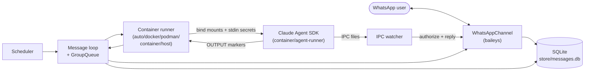

# NanoClaw — Project Overview

NanoClaw is a personal Claude assistant you talk to from WhatsApp. A single
Node.js orchestrator connects to WhatsApp, routes triggered messages to the
Claude Agent SDK, and runs every agent invocation inside an isolated Linux
container. Each chat ("group") gets its own filesystem, memory, Claude session,
and IPC namespace. It is intentionally small — 17 source files in `src/` — so
you can read it, understand it, and customize it (via Claude Code) to fit your
exact needs.

See [README.md](../../README.md) for philosophy and
[docs/REQUIREMENTS.md](../REQUIREMENTS.md) for the original design decisions.

## Key capabilities

| Area | Description |
|---|---|
| WhatsApp I/O | Message Claude from your phone; trigger with `@<name>` (default `@Andy`) |
| Per-group isolation | Each group has its own folder, `CLAUDE.md` memory, `.claude/` session dir, and IPC namespace, and runs in its own container with only that filesystem mounted |
| Main channel | Your private self-chat is the admin channel — it can register groups, manage all tasks, and configure mounts; every other group is fully isolated |
| Container isolation | Agents run in Docker / Podman / Apple Container; only explicitly bind-mounted paths are visible |
| Pluggable runtime | `CONTAINER_RUNTIME` selects `auto` / `docker` / `podman` / `container`, or `host` for no sandbox |
| Scheduled tasks | `cron` / `interval` / `once` jobs that run a full agent and can message you back; runs are logged |
| Agent swarms | Teams of subagents that collaborate (enabled via `CLAUDE_CODE_EXPERIMENTAL_AGENT_TEAMS`) |
| Web + browser | Web search/fetch and `agent-browser` (Chromium) automation inside the container |
| Concurrency control | Per-group serialization plus a global container cap (`MAX_CONCURRENT_CONTAINERS`) |
| Customization via skills | `/setup`, `/customize`, `/update`, `/add-telegram`, `/add-gmail`, … transform your fork |
| Cross-platform | macOS, Linux, and native Windows 10/11 (orchestrator native; agents in Linux containers) |

## Quick architecture overview



A more detailed component and system-context diagram lives in
[ARCHITECTURE.md](./ARCHITECTURE.md).

## Data model

All durable state is in one SQLite database, `store/messages.db`, created by
`src/db.ts`. Tables:

| Table | Purpose |
|---|---|
| `chats` | Chat metadata (jid, name, last activity, channel, is_group) |
| `messages` | Message history for registered groups (with bot-message flag) |
| `scheduled_tasks` | Recurring/one-time jobs (`cron`/`interval`/`once`, `group`/`isolated` context) |
| `task_run_logs` | Per-run history with duration and status |
| `router_state` | Message-loop cursors (`last_timestamp`, per-group `last_agent_timestamp`) |
| `sessions` | Per-group Claude session IDs (`group_folder` → `session_id`) |
| `registered_groups` | Groups the orchestrator acts on (`folder` is UNIQUE — anchors the hijack guard) |

The key durable types from `src/types.ts`:

```typescript
interface RegisteredGroup {
  name: string;
  folder: string;                 // validated: ^[A-Za-z0-9][A-Za-z0-9_-]{0,63}$
  trigger: string;
  added_at: string;
  containerConfig?: ContainerConfig; // additionalMounts, timeout
  requiresTrigger?: boolean;      // default true for groups, false for solo chats
}

interface ScheduledTask {
  id: string;
  group_folder: string;
  chat_jid: string;
  prompt: string;
  schedule_type: 'cron' | 'interval' | 'once';
  schedule_value: string;
  context_mode: 'group' | 'isolated';
  next_run: string | null;
  last_run: string | null;
  last_result: string | null;
  status: 'active' | 'paused' | 'completed';
  created_at: string;
}
```

## Directory structure

```
nanoclaw/
├── src/                       # Orchestrator (17 TS files — the dependency graph scope)
│   ├── index.ts               #   Entry: state, message loop, agent invocation
│   ├── config.ts / env.ts     #   Config + .env parsing (secrets stay off process.env)
│   ├── logger.ts / types.ts   #   pino logger + shared types/interfaces
│   ├── db.ts                  #   SQLite schema, accessors, migrations
│   ├── router.ts              #   Message formatting + channel routing
│   ├── group-folder.ts        #   Group-folder name validation + safe path resolution
│   ├── group-queue.ts         #   Per-group queue + global concurrency limit
│   ├── container-runner.ts    #   Mount building + agent process driver
│   ├── container-runtime.ts   #   Runtime abstraction (auto/docker/podman/container/host)
│   ├── mount-security.ts      #   Additional-mount allowlist validation
│   ├── ipc.ts                 #   IPC watcher: per-group namespaces + authorization
│   ├── task-scheduler.ts      #   Scheduled-task loop
│   ├── fs-sync.ts             #   Content-aware directory sync
│   ├── whatsapp-auth.ts       #   Standalone WhatsApp auth script
│   └── channels/whatsapp.ts   #   WhatsAppChannel (baileys)
├── setup/                     # /setup step runner (environment, container, whatsapp-auth,
│                              #   groups, register, mounts, service, verify)
├── skills-engine/             # /update + /customize machinery (apply/merge/rebase/migrate)
├── container/                 # Agent sandbox
│   ├── Dockerfile / build.sh  #   Agent image build
│   ├── agent-runner/          #   In-container Claude Agent SDK runner (+ IPC MCP server)
│   └── skills/                #   Skills synced into each group's .claude/skills (e.g. agent-browser)
├── tools/                     # Dev tooling (create-dependency-graph, chunking, compression)
├── docs/                      # Documentation (REQUIREMENTS, SECURITY, architecture/, …)
├── groups/                    # Per-group folders + global memory (groups/global/, groups/*/CLAUDE.md)
├── store/                     # SQLite DB + WhatsApp auth state (runtime)
└── data/                      # Sessions, per-group IPC tree, snapshots (runtime)
```

The autogenerated module breakdown lives at
[DEPENDENCY_GRAPH.md](./DEPENDENCY_GRAPH.md). Note that `setup/`,
`skills-engine/`, and `container/agent-runner/` are part of the system but are
*not* covered by the dependency graph (which scans `src/` only).

## Key design principles

1. **Small enough to understand** — one process, 17 source files, no
   microservices or abstraction layers.
2. **Secure by container isolation** — OS-level sandboxing, not application
   permission checks; agents see only what is bind-mounted.
3. **Per-group isolation** — separate folder, memory, session, and IPC namespace
   per group; validated folder names that cannot escape their base directory.
4. **Customization = code** — minimal config; capabilities are added by editing
   code or running `/add-*` skills, not by toggling features.
5. **Filesystem IPC** — the in-container agent talks to the host by writing JSON
   files into a bind-mounted directory; the directory *is* the agent's identity.
6. **Fail-closed security** — no mount allowlist means no additional mounts; the
   allowlist lives outside every container so agents cannot tamper with it.

## Storage files

| Path | Purpose |
|---|---|
| `store/messages.db` | SQLite: chats, messages, tasks, run logs, router state, sessions, registered groups |
| `store/auth/` | WhatsApp multi-file auth state (baileys) |
| `groups/<folder>/` | Per-group working dir + `CLAUDE.md` memory + `logs/` |
| `groups/global/` | Global memory (read-only for non-main groups) |
| `data/sessions/<folder>/.claude/` | Per-group isolated Claude config/session dir |
| `data/sessions/<folder>/agent-runner-src/` | Per-group writable agent-runner source copy |
| `data/ipc/<folder>/` | Per-group IPC namespace (`messages/`, `tasks/`, `input/`) + snapshots |
| `~/.config/nanoclaw/mount-allowlist.json` | Additional-mount allowlist (outside all mounts) |

## Getting started

NanoClaw is AI-native: Claude Code drives setup. From a clone:

```bash
git clone https://github.com/qwibitai/nanoclaw.git
cd nanoclaw
claude
```

Then run `/setup`. It walks through dependencies, WhatsApp authentication
(QR code), container/runtime setup, registering your main channel, optional
mount configuration, and installing the background service for your platform.

For development:

```bash
npm run dev          # Run with hot reload
npm run build        # Compile TypeScript
./container/build.sh # Rebuild the agent container image (macOS/Linux/WSL)
container\build.cmd  # Rebuild the agent container image (native Windows)
```

To run the agent without a container (`host` mode), build the agent-runner once:

```bash
cd container/agent-runner && npm install && npm run build
```

## Environment variables

Configuration is intentionally minimal. From `src/config.ts`, `src/env.ts`, and
`src/container-runtime.ts`:

| Variable | Default | Purpose |
|---|---|---|
| `ASSISTANT_NAME` | `Andy` | Trigger word — agent responds to `@<name>` |
| `ASSISTANT_HAS_OWN_NUMBER` | `false` | Whether the assistant runs on its own WhatsApp number |
| `CONTAINER_RUNTIME` | `auto` | `auto` / `docker` / `podman` / `container` / `host` |
| `CONTAINER_IMAGE` | `nanoclaw-agent:latest` | Agent container image |
| `CONTAINER_TIMEOUT` | `1800000` (30m) | Hard agent timeout (ms); clamped to 24h |
| `CONTAINER_MAX_OUTPUT_SIZE` | `10485760` (10MB) | Max captured stdout/stderr per run |
| `IDLE_TIMEOUT` | `1800000` (30m) | How long to keep a container alive after the last result |
| `MAX_CONCURRENT_CONTAINERS` | `5` | Global cap on simultaneous agent containers |
| `TZ` | system timezone | Timezone for cron schedules and container clock |
| `CLAUDE_CODE_OAUTH_TOKEN` | — | Claude Code OAuth credential (read from `.env`, passed via stdin) |
| `ANTHROPIC_API_KEY` | — | Alternative Anthropic API credential (read from `.env`, passed via stdin) |
| `LOG_LEVEL` | — | `debug`/`trace` enable verbose run logs |

Secrets (`CLAUDE_CODE_OAUTH_TOKEN`, `ANTHROPIC_API_KEY`) are deliberately *not*
loaded into `process.env`; they are read from `.env` only at spawn time and
written to the container's stdin, never to disk or a mounted file. Polling
intervals (`POLL_INTERVAL` 2s, `SCHEDULER_POLL_INTERVAL` 60s,
`IPC_POLL_INTERVAL` 1s) are constants in `src/config.ts`.

## Related documentation

- [ARCHITECTURE.md](./ARCHITECTURE.md) — in-depth technical architecture
- [COMPONENTS.md](./COMPONENTS.md) — module-by-module breakdown
- [DATAFLOW.md](./DATAFLOW.md) — message → container data-flow patterns
- [API.md](./API.md) — public/exported API reference
- [DEPENDENCY_GRAPH.md](./DEPENDENCY_GRAPH.md) — autogenerated dependency analysis
- [TEST_COVERAGE.md](./TEST_COVERAGE.md) — autogenerated test-coverage report
- [../REQUIREMENTS.md](../REQUIREMENTS.md) — original requirements and decisions
- [../SECURITY.md](../SECURITY.md) — full security model
